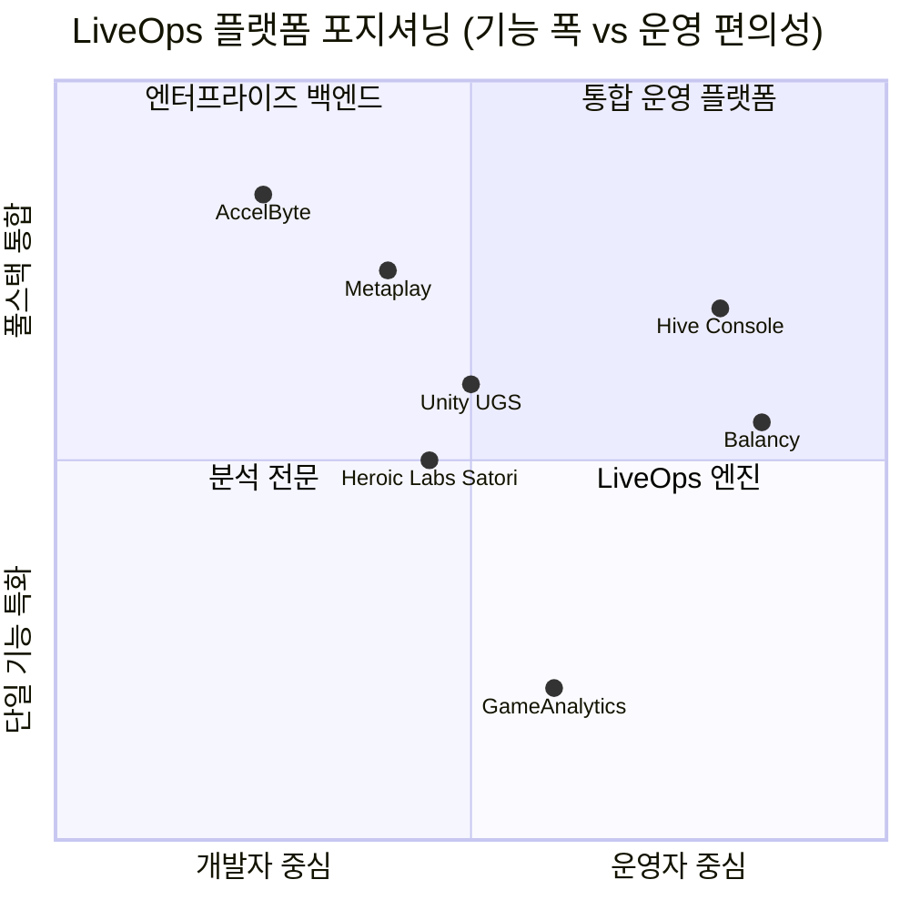

# 리서치 리포트: LiveOps 플랫폼 경쟁사 기능 분석

## 문서 정보

| 항목 | 내용 |
|------|------|
| ID | RES-GLO-002 |
| 버전 | v1.0 |
| 작성일 | 2026-03-09 |
| 리서치 유형 | 경쟁사 분석 (Competitor Analysis) |
| 데이터 기준일 | 2026-03-09 |
| 조사 대상 | Heroic Labs Satori, Unity (Push Notifications + Game Overrides), AccelByte, Hive Console, Balancy, GameAnalytics, Metaplay |

---

## 1. Executive Summary

7개 주요 LiveOps 플랫폼(Heroic Labs Satori, Unity, AccelByte, Hive Console, Balancy, GameAnalytics, Metaplay)의 공식 문서를 분석한 결과, LiveOps 시스템은 **플레이어 세그멘테이션**, **이벤트 관리**, **실험/A/B 테스트**, **원격 설정**, **푸시 알림**, **분석/대시보드**, **경제 시스템** 7개 핵심 카테고리로 수렴된다.

모든 플랫폼이 공통으로 제공하는 기능은 세그멘테이션, A/B 테스트, 푸시 알림, 분석 대시보드이며, 플랫폼별 차별화는 게임 경제(AccelByte, Balancy), 실시간 설정 관리(Metaplay, Unity), 데이터 파이프라인(GameAnalytics, Heroic Labs)에서 두드러진다.

### Key Findings

- **Finding 1**: 세그멘테이션 + A/B 테스트 + 원격 설정의 삼각 조합이 모든 플랫폼에서 핵심 기능군으로 등장한다.
- **Finding 2**: 게임 경제(상점, 시즌 패스, 배틀 패스, 가상 화폐)는 중대형 플랫폼의 필수 구성 요소로 자리잡았다.
- **Finding 3**: 데이터 파이프라인(Snowflake, BigQuery 연동)과 실시간 이벤트 수집은 엔터프라이즈급 플랫폼의 차별화 요소이다.
- **Finding 4**: 플레이어 지원(Customer Support) 도구가 독립 모듈로 포함되는 추세이며, GDPR 준수가 필수 요건화되고 있다.

### Recommendations

1. 필수 7개 카테고리(세그멘테이션, 이벤트, A/B 테스트, 원격 설정, 푸시 알림, 분석, 경제) 기반으로 핵심 기능 범위를 정의할 것
2. 관리자 대시보드는 기술자 전용이 아닌 운영자(LiveOps팀) 중심의 인터페이스로 설계할 것
3. 데이터 export(웹훅/파이프라인)는 초기부터 아키텍처에 반영할 것

---

## 2. 플랫폼별 주요 기능 요약

### 2.1 Heroic Labs Satori

**플랫폼 성격**: 독립형 LiveOps 엔진. Nakama 게임 서버와 연동되는 전문 LiveOps SaaS.

| 카테고리 | 주요 기능 |
|----------|----------|
| 플레이어 데이터 | 커스텀 Identity 속성, 이벤트 캡처, 세션 관리 |
| 세그멘테이션 | 무제한 필터 기반 오디언스 정의, 외부 CRM/BI 연동, 동적 재계산 |
| Feature Flags | 플레이어/오디언스별 Flag 배포, VIP 전용 기능 분기, 전역/타겟 배포 |
| 실험 (A/B Test) | 다중 오디언스 실험, 멀티 페이즈 실험, 목표 지표 설정 및 추적 |
| 라이브 이벤트 | 이벤트 캘린더(1/2/4주 뷰), 자동 트리거, 배틀 패스 / 오퍼 월 / 토너먼트 워크플로우 |
| 메시징 | 푸시 알림 + 이메일 템플릿, 이벤트 런칭 시 자동 발송, 스케줄링, OneSignal 연동 |
| 분석 | 지표 모니터링 + 알림, 멀티 축 지표 정의, 커스텀 위젯 대시보드 |
| 데이터 파이프라인 | Snowflake / BigQuery / Redshift / S3 Export, 웹훅(Feature Flag·이벤트 변경 시) |

**특징**: 실험 엔진의 완성도가 높으며, 데이터 스키마 제약을 통한 클라이언트 이벤트 품질 관리 기능 제공.

---

### 2.2 Unity (Push Notifications + Game Overrides)

**플랫폼 성격**: Unity Gaming Services(UGS) 생태계 내 LiveOps 모듈 조합. 기존 Unity 개발자 대상.

| 카테고리 | 주요 기능 |
|----------|----------|
| 원격 설정 | Remote Config (Key-Value 파라미터 네임스페이스), 앱 업데이트 없이 게임 설정 변경 |
| 게임 오버라이드 | 플레이어/그룹별 설정 오버라이드, 배포 시점/대상 제어, 서버 사이드 적용 |
| 푸시 알림 | iOS/Android 푸시 발송, 오디언스 타겟팅(Analytics 연동), 예약 발송, 자동화 알림 |
| A/B 테스트 | 게임 설정 변수 실험, 레벨 난이도 등 컨텐츠 변수 실험 |
| 분석 | Unity Analytics 연동, 플레이어 행동 기반 오디언스 구성 |
| 클라우드 인프라 | Cloud Save, Cloud Code (서버리스), Cloud Content Delivery |
| 인앱 결제 | IAP 관리, Economy 시스템, Wallet |
| 기타 | Achievements, Leaderboards, Authentication, Diagnostics(실시간 에러 모니터링) |

**특징**: Unity 엔진 사용자에게 가장 낮은 통합 비용. 각 서비스가 모듈식으로 독립 제공되며 UGS 대시보드에서 통합 관리.

---

### 2.3 AccelByte

**플랫폼 성격**: 엔터프라이즈급 풀스택 게임 백엔드. AAA 및 크로스 플랫폼 라이브 서비스 특화.

| 카테고리 | 주요 기능 |
|----------|----------|
| 플레이어 경제 | Store & Catalog, Wallet & Payments, Inventory, Rewards |
| 진행도/콘텐츠 | Season Pass (무료/프리미엄 패스, XP 기반 티어), Challenges (동적 퀘스트), Achievements |
| 사회적 기능 | Friends, Presence, Guilds & Clans, Chat, Parties |
| 멀티플레이어 | Matchmaking, Session 관리, Dedicated Server Hub, P2P 네트워킹 |
| 클라우드 인프라 | Cloud Save, 통계(Statistics), 리더보드(Leaderboards) |
| UGC | 유저 생성 콘텐츠 관리 |
| 기반 서비스 | Identity & Access, Legal & Privacy, Game Analytics, 관리 툴 |
| 확장성 | Extend (커스텀 백엔드 로직 호스팅, 오픈소스 앱 디렉토리) |

**특징**: 크로스 플랫폼(PC, 콘솔, 모바일) 지원 강점. Season Pass 구조가 상세하며 XP/티어/보상 체계가 완전 구현됨.

---

### 2.4 Hive Console

**플랫폼 성격**: 모바일 게임 운영 통합 콘솔. 한국 모바일 게임 시장에 특화된 All-in-One 운영 도구.

| 카테고리 | 주요 기능 |
|----------|----------|
| 프로비저닝 | SDK 설정, 이용약관 관리, 공지 팝업, 원격 로깅, Webview 접근 제어 |
| 인증/사용자 | 복수 IdP 로그인, 기기 관리, 해외 로그인 제한, 계정 정지 도구, 플레이어 ID 동기화 |
| 결제/수익화 | 복수 마켓 상점 설정, 아이템 등록, 쿠폰 시스템, 가격 티어, 환불/자동환불, 구독 관리 |
| 푸시 알림 | iOS/Android 인증서 관리, 캠페인 생성 + 스케줄링, 타겟팅 데이터 등록, 템플릿 관리 |
| 프로모션 캠페인 | 이벤트 배너/미디어 관리, 롤링/스팟 배너, UA 캠페인, 딥링크 관리, 보상 테스트 |
| 분석/리포트 | 유저 지표 대시보드, 게임플레이 분석, 리텐션/퍼널 분석, 커스텀 지표, 데이터 export |
| 커뮤니티/지원 | FAQ 및 템플릿 관리, 고객 문의 처리, 이메일 통합, VIP 사용자 관리 |

**특징**: 운영자 친화적 UI가 강점. 결제/환불/쿠폰 관리가 타 플랫폼 대비 세밀하게 구현됨.

---

### 2.5 Balancy

**플랫폼 성격**: 노코드/로우코드 LiveOps 콘텐츠 관리 플랫폼. 디자이너/기획자도 직접 운영 가능.

| 카테고리 | 주요 기능 |
|----------|----------|
| 이벤트 관리 | Game Events 생성/관리, 이벤트 기반 트리거 |
| 수익화 | Smart Offers, In-Game Shop, Virtual Economy (가상 화폐 경제 시스템) |
| 진행도 | Battle Pass, Daily Bonus, Inventory, Tasks (퀘스트/목표) |
| 세그멘테이션 | 플레이어 세그멘테이션, Conditions (규칙 기반 로직), Overrides (설정 커스터마이징) |
| 프로필 관리 | Profiles & User Properties, 플레이어 데이터 관리 |
| 실험 | A/B Tests, 기능 실험 프레임워크 |
| 메시징 | Push Notifications |
| 콘텐츠 관리 | 에셋 및 로컬라이제이션, UI Builder, Visual Scripting (고급 자동화) |
| 대시보드 | 중앙 운영 관리 인터페이스 |

**특징**: Visual Scripting과 UI Builder로 엔지니어 의존도 최소화. 콘텐츠 로컬라이제이션이 내장됨.

---

### 2.6 GameAnalytics

**플랫폼 성격**: 게임 특화 분석 플랫폼. LiveOps 실행보다 데이터 인텔리전스에 집중.

| 카테고리 | 주요 기능 |
|----------|----------|
| 분석 (AnalyticsIQ) | 사전 구축 + 커스텀 대시보드, Explore Tool + Query Builder, 퍼널 & 코호트, 실시간 모니터링, 기술 성능/에러 추적, 예약 이메일 리포트 |
| 세그멘테이션 (SegmentIQ) | 동적 사용자 세그멘테이션, 이탈/리텐션 신호, 수익화 패턴 식별, 이벤트 레벨 행동 매핑, 고가치 플레이어 식별, 타겟 A/B 테스트, 원격 설정 관리 |
| 데이터 파이프라인 (PipelineIQ) | 실시간 데이터 웨어하우스, Raw 이벤트 Export, 커스텀 디멘션, 데이터 공유 인프라, API 접근 |
| 시장 인텔리전스 (MarketIQ) | 30억+ 광고 크리에이티브 라이브러리, 경쟁사 광고 전략 분석, 앱 퍼포먼스 추적, 스토어 랭킹 |

**특징**: 분석 전문 플랫폼으로 MarketIQ(경쟁사 광고 인텔리전스)는 타 플랫폼에 없는 독자 기능. LiveOps 실행 도구보다는 의사결정 지원 도구.

---

### 2.7 Metaplay

**플랫폼 성격**: 모바일 F2P 게임 전용 게임 서버 + LiveOps 대시보드 통합 플랫폼.

| 카테고리 | 주요 기능 |
|----------|----------|
| 플레이어 관리 | 완전한 플레이어 상태 조회 (human-readable), 검색/필터/정렬, 계정 조치(이름 변경, 차단, 기기 재연결), Analytics 이벤트·로그인·인시던트·감사 이력 조회 |
| 인게임 커뮤니케이션 | 인게임 메일(아이템 첨부 가능), 길드 속성/멤버십/역할 관리, GDPR 데이터 Export/삭제 |
| 게임 설정 관리 | Config 비교/Diff 도구, Config 빌드 검증, 릴리즈 워크플로우, 앱 업데이트 없이 즉시 반영 |
| 플레이어 타겟팅 | 커스텀 세그먼트 정의 (유연한 규칙), 세그먼트 사용 현황 모니터링, 세그먼트별 플레이어 수 조회 |
| 캠페인/브로드캐스트 | 대규모 인게임 메일 캠페인(Broadcasts), 세그먼트 타겟팅, 아이템/리소스 첨부 |
| 이벤트/오퍼 | 이벤트 및 오퍼 설정 조회, 플레이어 관점 미리보기, 실시간 성과 데이터 |
| 실험 관리 | A/B 테스트 변형 관리, 세밀한 롤아웃 타겟팅, 비공개 사전 테스트, 통계 추적 |
| 보안/접근 제어 | SSO(Google, GitHub, Atlassian), 커스텀 역할 + 세분화 권한, Safety Lock(실수 방지), GDPR 감사 로그 |
| 인시던트 관리 | 클라이언트 문제 기반 인시던트 리포트, 로그/스택 트레이스 번들링, Grafana 딥링크 |

**특징**: 고객지원 에이전트 전용 제한 접근 모드 제공. 타임라인 시각화(이벤트/아이템 일정 시각화)가 차별화 기능.

---

## 3. 공통 핵심 기능 카테고리 분류

아래 표는 7개 플랫폼에서 공통으로 등장하는 기능을 카테고리별로 분류하고 지원 현황을 정리한 것이다.

### 3.1 카테고리 1: 플레이어 세그멘테이션 (Player Segmentation)

| 기능명 | 설명 | 지원 플랫폼 수 |
|--------|------|--------------|
| 규칙 기반 세그먼트 정의 | 플레이어 속성/행동 기반 그룹 생성 | 7/7 |
| 동적 세그먼트 재계산 | 실시간 또는 주기적 멤버십 업데이트 | 5/7 |
| 외부 CRM/BI 연동 | 세그먼트 외부 임포트/익스포트 | 3/7 |
| 이벤트 기반 필터 | 특정 이벤트 발생 조건으로 세그먼트 구성 | 5/7 |
| VIP/고가치 플레이어 식별 | 수익화 패턴 기반 핵심 유저 분류 | 4/7 |

**지원 플랫폼**: Heroic Labs Satori, Unity, AccelByte, Hive Console, Balancy, GameAnalytics, Metaplay

---

### 3.2 카테고리 2: 라이브 이벤트 관리 (Live Event Management)

| 기능명 | 설명 | 지원 플랫폼 수 |
|--------|------|--------------|
| 이벤트 생성 및 스케줄링 | 시작/종료 시간 기반 이벤트 정의 | 6/7 |
| 이벤트 캘린더 뷰 | 타임라인/캘린더 형식으로 이벤트 현황 시각화 | 4/7 |
| 세그먼트 기반 이벤트 타겟팅 | 특정 플레이어 그룹에만 이벤트 노출 | 6/7 |
| 이벤트 템플릿 | 배틀 패스, 오퍼 월, 토너먼트 등 사전 정의 워크플로우 | 3/7 |
| 실시간 성과 데이터 | 진행 중인 이벤트의 참여율/전환율 실시간 조회 | 5/7 |

**지원 플랫폼**: Heroic Labs Satori, Unity, AccelByte, Hive Console, Balancy, Metaplay (GameAnalytics는 분석 전용)

---

### 3.3 카테고리 3: 실험 및 A/B 테스트 (Experiments & A/B Testing)

| 기능명 | 설명 | 지원 플랫폼 수 |
|--------|------|--------------|
| 변형(Variant) 정의 | 실험 대상 설정값 또는 콘텐츠 변형 생성 | 7/7 |
| 오디언스 타겟 롤아웃 | 특정 세그먼트에만 실험 변형 적용 | 7/7 |
| 목표 지표 추적 | 실험 성과 측정을 위한 KPI 설정 | 5/7 |
| 비공개 사전 테스트 | 실제 플레이어 노출 전 내부 검증 | 3/7 |
| 멀티 페이즈 실험 | 복수 오디언스/단계로 순차 롤아웃 | 2/7 |
| 통계적 유의성 판단 | 실험 결과의 통계적 분석 및 추천 | 3/7 |

**지원 플랫폼**: Heroic Labs Satori, Unity, AccelByte, Balancy, GameAnalytics, Metaplay (Hive Console은 부분 지원)

---

### 3.4 카테고리 4: 원격 설정 및 Feature Flags (Remote Config & Feature Flags)

| 기능명 | 설명 | 지원 플랫폼 수 |
|--------|------|--------------|
| Key-Value 원격 설정 | 앱 업데이트 없이 게임 파라미터 변경 | 7/7 |
| Feature Flag 관리 | 기능 활성화/비활성화 제어 | 5/7 |
| 플레이어별 설정 오버라이드 | 개별 또는 그룹 단위 설정 재정의 | 6/7 |
| Config 버전 비교/Diff | 설정 변경 이력 및 비교 도구 | 3/7 |
| Config 배포 워크플로우 | 검증 후 단계적 릴리즈 | 3/7 |
| 웹훅 알림 | Flag/설정 변경 시 외부 시스템 알림 | 2/7 |

**지원 플랫폼**: Heroic Labs Satori, Unity, AccelByte, Hive Console, Balancy, Metaplay (GameAnalytics는 SegmentIQ 내 원격 설정)

---

### 3.5 카테고리 5: 푸시 알림 및 메시징 (Push Notifications & Messaging)

| 기능명 | 설명 | 지원 플랫폼 수 |
|--------|------|--------------|
| iOS/Android 푸시 발송 | 표준 모바일 푸시 알림 발송 | 6/7 |
| 오디언스 타겟팅 발송 | 세그먼트 기반 타겟 발송 | 6/7 |
| 예약 발송 | 특정 시간에 발송 예약 | 6/7 |
| 자동화 트리거 발송 | 이벤트/조건 충족 시 자동 발송 | 4/7 |
| 인게임 메일 | 게임 내 메시지 + 아이템 첨부 | 3/7 |
| 템플릿 관리 | 재사용 가능한 메시지 템플릿 | 5/7 |
| 발송 성과 분석 | 열람율, 클릭율 등 추적 | 4/7 |
| 대규모 브로드캐스트 | 전체 또는 대규모 플레이어 대상 캠페인 | 4/7 |

**지원 플랫폼**: Heroic Labs Satori, Unity, Hive Console, Balancy, Metaplay, AccelByte (GameAnalytics는 미지원)

---

### 3.6 카테고리 6: 분석 및 대시보드 (Analytics & Dashboard)

| 기능명 | 설명 | 지원 플랫폼 수 |
|--------|------|--------------|
| 실시간 플레이어 지표 | DAU, 리텐션, 세션 시간 등 핵심 지표 | 7/7 |
| 커스텀 대시보드 | 사용자 정의 위젯/차트 구성 | 5/7 |
| 퍼널 분석 | 플레이어 이탈 지점 추적 | 4/7 |
| 코호트 분석 | 가입 시점별 그룹 행동 분석 | 3/7 |
| 이벤트 레벨 행동 추적 | 세분화된 인게임 이벤트 로그 | 5/7 |
| 에러/기술 성능 모니터링 | 크래시, 에러, 지연 추적 | 3/7 |
| 데이터 Export | Raw 데이터 외부 추출 | 5/7 |
| 외부 데이터 웨어하우스 연동 | BigQuery, Snowflake, Redshift 등 | 3/7 |

**지원 플랫폼**: 전 플랫폼 (GameAnalytics가 가장 특화)

---

### 3.7 카테고리 7: 게임 경제 시스템 (Game Economy)

| 기능명 | 설명 | 지원 플랫폼 수 |
|--------|------|--------------|
| 가상 화폐/지갑 | 인게임 화폐 발행 및 관리 | 5/7 |
| 상점/카탈로그 | 아이템 판매 및 가격 관리 | 5/7 |
| 인벤토리 | 플레이어 아이템 소유 관리 | 5/7 |
| 시즌 패스 | 기간 한정 유료/무료 패스 진행 시스템 | 4/7 |
| 배틀 패스 | 티어 기반 보상 잠금 해제 시스템 | 3/7 |
| 일일 보너스 | 반복 보상 시스템 | 3/7 |
| 쿠폰 시스템 | 프로모션 코드 생성 및 관리 | 2/7 |
| 가격 티어 관리 | 국가/마켓별 가격 설정 | 2/7 |
| 환불 처리 | 결제 취소 및 자동 환불 | 2/7 |

**지원 플랫폼**: AccelByte, Hive Console, Balancy, Unity (IAP/Economy), Heroic Labs (Satori + Nakama)

---

### 3.8 카테고리 8: 플레이어 지원 및 운영 (Player Support & Operations)

| 기능명 | 설명 | 지원 플랫폼 수 |
|--------|------|--------------|
| 플레이어 상태 조회 | 관리자가 개별 플레이어 데이터 조회 | 5/7 |
| 계정 조치 | 차단, 이름 변경, 기기 연결 관리 | 4/7 |
| 고객 문의 처리 | 인게임 CS 티켓 관리 | 3/7 |
| GDPR 데이터 Export/삭제 | 개인정보 규정 준수 도구 | 3/7 |
| 감사 로그 | 관리자 액션 이력 추적 | 4/7 |
| 역할 기반 접근 제어 | 권한 수준별 관리자 역할 정의 | 5/7 |
| SSO 연동 | Google, GitHub 등 관리자 SSO 로그인 | 3/7 |

**지원 플랫폼**: Metaplay, AccelByte, Hive Console, Unity, Heroic Labs

---

## 4. LiveOps 시스템 구축 필수/권장/선택 기능 분류

### 4.1 필수 기능 (Must-Have)

서비스 출시 전 반드시 구현되어야 하는 기능. 미구현 시 기본적인 LiveOps 운영 불가.

| No. | 기능 | 카테고리 | 근거 |
|-----|------|----------|------|
| 1 | 플레이어 세그먼트 정의 및 관리 | 세그멘테이션 | 7/7 플랫폼 공통. 모든 타겟팅 기능의 기반 |
| 2 | Key-Value 원격 설정 (Remote Config) | 원격 설정 | 앱 업데이트 없이 게임 밸런스 조정 필수 |
| 3 | 라이브 이벤트 생성 및 스케줄링 | 이벤트 관리 | 플레이어 재참여의 핵심 도구 |
| 4 | A/B 테스트 (기본 변형 실험) | 실험 | 데이터 기반 의사결정의 필수 도구 |
| 5 | 모바일 푸시 알림 발송 | 메시징 | 비활성 유저 재활성화의 가장 효과적 수단 |
| 6 | 핵심 지표 대시보드 (DAU, 리텐션, 수익) | 분석 | 운영 상태 모니터링 필수 |
| 7 | 플레이어 상태 조회 및 기본 계정 조치 | 플레이어 지원 | CS 대응 최소 요건 |
| 8 | 역할 기반 접근 제어 (RBAC) | 운영 보안 | 관리자 권한 분리 필수 |

---

### 4.2 권장 기능 (Should-Have)

출시 후 3-6개월 내 구현 권장. 미구현 시 운영 효율과 수익화에 제약.

| No. | 기능 | 카테고리 | 근거 |
|-----|------|----------|------|
| 1 | Feature Flag 관리 | 원격 설정 | 기능 점진적 롤아웃 및 신속한 롤백 |
| 2 | 세그먼트 기반 타겟 푸시 알림 | 메시징 | 개인화 메시지로 전환율 향상 |
| 3 | 이벤트 성과 실시간 모니터링 | 분석 | 진행 중 이벤트 즉각 대응 |
| 4 | 가상 화폐 및 상점 관리 | 게임 경제 | 수익화 핵심 레버 |
| 5 | 인벤토리 및 보상 시스템 | 게임 경제 | 이벤트 보상 배포 필수 |
| 6 | 인게임 메일 (아이템 첨부) | 메시징 | CS 보상 지급 및 캠페인 전달 |
| 7 | GDPR 플레이어 데이터 Export/삭제 | 규정 준수 | 규제 리스크 대응 (글로벌 서비스 시 필수) |
| 8 | 이벤트 캘린더 뷰 | 이벤트 관리 | 운영팀 일정 관리 효율화 |
| 9 | 감사 로그 | 운영 보안 | 관리자 액션 추적 및 분쟁 대응 |
| 10 | 퍼널 및 리텐션 분석 | 분석 | 이탈 원인 파악 및 개선 |

---

### 4.3 선택 기능 (Nice-to-Have)

성숙 단계 서비스 또는 특정 게임 장르에 유효한 기능. 우선순위 하위.

| No. | 기능 | 카테고리 | 적합한 경우 |
|-----|------|----------|------------|
| 1 | 시즌 패스 / 배틀 패스 시스템 | 게임 경제 | RPG, 전략, 캐주얼 이상 규모 서비스 |
| 2 | 멀티 페이즈 / 통계적 A/B 테스트 | 실험 | 대규모 DAU 보유 서비스 |
| 3 | 외부 데이터 웨어하우스 연동 (BigQuery 등) | 데이터 파이프라인 | 자체 BI 팀 보유 시 |
| 4 | Visual Scripting / 노코드 자동화 | 운영 자동화 | 비기술 운영팀 자율성 확보 시 |
| 5 | 쿠폰 시스템 | 게임 경제 | 프로모션 마케팅 중심 서비스 |
| 6 | 길드/클랜 관리 | 사회적 기능 | MMO, 길드전 중심 장르 |
| 7 | 코호트 분석 | 분석 | 장기 리텐션 최적화 단계 |
| 8 | 시장 인텔리전스 (경쟁사 광고 분석) | 마케팅 | UA 팀 운영 중인 서비스 |
| 9 | Config Diff / 배포 워크플로우 | 원격 설정 | 대규모 팀 / 다수 환경 운영 시 |
| 10 | 인시던트 리포트 자동화 | 운영 모니터링 | 기술 팀 규모 성장 후 |

---

## 5. 플랫폼 포지셔닝 비교

| 플랫폼 | 주요 강점 | 주요 약점 | 적합 대상 |
|--------|----------|----------|----------|
| Heroic Labs Satori | 실험 엔진, 데이터 파이프라인 | 게임 경제 기능 미포함 | 인디~미드사이즈, 실험 중심 팀 |
| Unity UGS | 낮은 통합 비용, 광범위한 기능 | 서비스 간 분절, 분석 깊이 한계 | Unity 엔진 사용 팀 |
| AccelByte | 크로스 플랫폼, 풀스택 | 구축/운영 비용 높음 | AAA, 콘솔/PC 멀티플랫폼 |
| Hive Console | 운영자 UX, 결제/쿠폰 세밀도 | 실험 기능 약함 | 한국 모바일 게임 운영팀 |
| Balancy | 노코드, 콘텐츠 관리 편의 | 대규모 데이터 처리 한계 | 소규모팀, 비기술 운영자 |
| GameAnalytics | 분석 깊이, 시장 인텔리전스 | LiveOps 실행 도구 미포함 | BI/데이터 분석 팀 |
| Metaplay | 플레이어 지원, Config 관리 | 모바일 F2P 특화 (범용성 제한) | 모바일 F2P, 고객지원 중심 팀 |

---

## 6. 시사점 및 제안

### 6.1 기회 영역

1. **운영자 친화적 통합 인터페이스**
   - 근거: 대부분 플랫폼이 개발자 중심 또는 기능별 분절된 UI 제공. Hive Console, Balancy만이 운영자 관점 UX 강조.
   - 예상 효과: 엔지니어 의존도 감소, 운영 주기 단축

2. **세그먼트-이벤트-보상 통합 파이프라인**
   - 근거: 세그멘테이션, 이벤트, 보상 지급이 각기 분리된 도구로 제공되는 경우가 많아 운영 마찰 발생.
   - 예상 효과: 이벤트 기획부터 실행까지 단일 워크플로우 내 처리 가능

3. **실시간 이벤트 모니터링 + 즉각 개입 기능**
   - 근거: 실시간 성과 확인 기능은 Metaplay, Heroic Labs만 강조. 이벤트 진행 중 긴급 수정 도구 부재가 공통 약점.
   - 예상 효과: 이벤트 장애 대응 시간 단축

### 6.2 리스크 요인

| 리스크 | 가능성 | 영향도 | 대응 방안 |
|--------|--------|--------|----------|
| 과도한 기능 범위 확장 | 높음 | 높음 | MVP 범위를 필수 8개 기능으로 제한 |
| 데이터 파이프라인 설계 후순위화 | 중간 | 높음 | 초기부터 이벤트 스키마 및 Export 아키텍처 설계 |
| GDPR 미대응 | 낮음 | 매우 높음 | 플레이어 데이터 Export/삭제 기능 초기 버전 포함 |
| 운영자 UX 소홀 | 중간 | 중간 | 운영팀 참여 UT 초기부터 진행 |

### 6.3 기획 방향 제안

1. **Phase 1 (MVP)**: 세그멘테이션 + 원격 설정 + 이벤트 스케줄링 + 기본 대시보드 + 푸시 알림 5개 기능으로 출시
2. **Phase 2**: A/B 테스트 + 인게임 메일 + 경제 시스템(상점/인벤토리/화폐) + GDPR 도구 추가
3. **Phase 3**: Feature Flag 고도화 + 시즌 패스/배틀 패스 + 데이터 파이프라인 연동 + Config Diff 도구

---

## 7. 출처

| No. | 출처 | URL | 접근일 |
|-----|------|-----|--------|
| 1 | Heroic Labs Satori 공식 문서 | https://heroiclabs.com/docs/satori/concepts/introduction/overview/ | 2026-03-09 |
| 2 | Heroic Labs Satori 제품 페이지 | https://heroiclabs.com/satori/ | 2026-03-09 |
| 3 | Heroic Labs Satori - Experiments | https://heroiclabs.com/satori/experiments/ | 2026-03-09 |
| 4 | Unity Push Notifications 문서 | https://docs.unity.com/ugs/en-us/manual/push-notifications/manual/overview | 2026-03-09 |
| 5 | Unity Game Overrides & Remote Config | https://docs.unity.com/en-us/remote-config/game-overrides-and-settings | 2026-03-09 |
| 6 | Unity LiveOps 제품 페이지 | https://unity.com/features/liveops | 2026-03-09 |
| 7 | AccelByte 공식 문서 포털 | https://docs.accelbyte.io/ | 2026-03-09 |
| 8 | AccelByte Season Pass 문서 | https://docs.accelbyte.io/gaming-services/modules/online/season-pass/ | 2026-03-09 |
| 9 | Hive Console 개발자 문서 | https://developers.hiveplatform.ai/ko/latest/operation/console/ | 2026-03-09 |
| 10 | Balancy LiveOps Overview | https://en.docsv2.balancy.dev/liveops/overview/ | 2026-03-09 |
| 11 | GameAnalytics 공식 문서 | https://docs.gameanalytics.com/ | 2026-03-09 |
| 12 | Metaplay LiveOps Dashboard 문서 | https://docs.metaplay.io/liveops-dashboard/introduction-to-the-liveops-dashboard | 2026-03-09 |
| 13 | Metaplay LiveOps 제품 페이지 | https://www.metaplay.io/liveops | 2026-03-09 |

---

## 변경 이력

| 버전 | 일자 | 변경 내용 | 작성자 |
|------|------|----------|--------|
| v1.0 | 2026-03-09 | 초안 작성 - 7개 플랫폼 기능 분석 및 카테고리 분류 | researcher |
