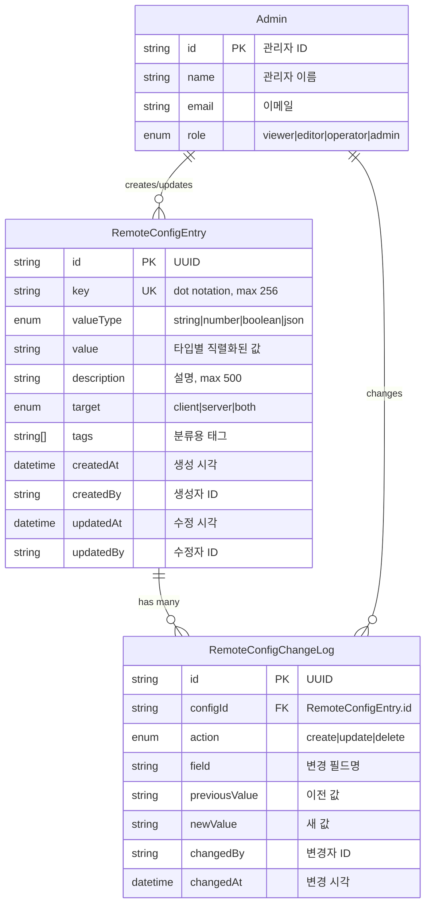
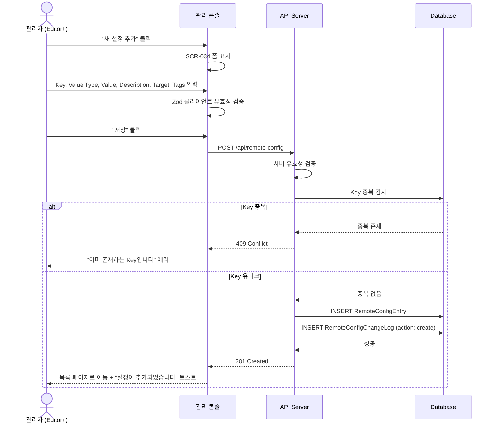
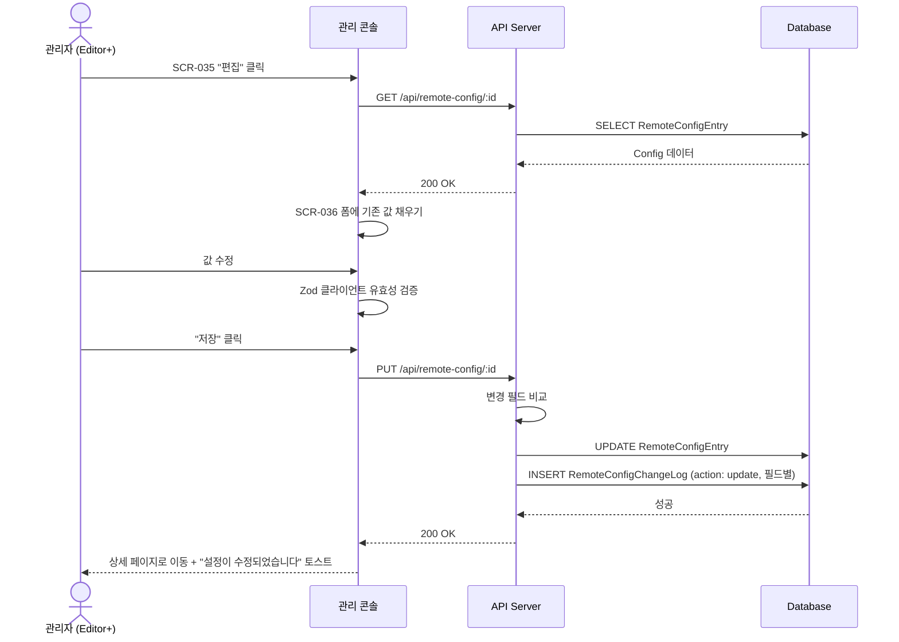
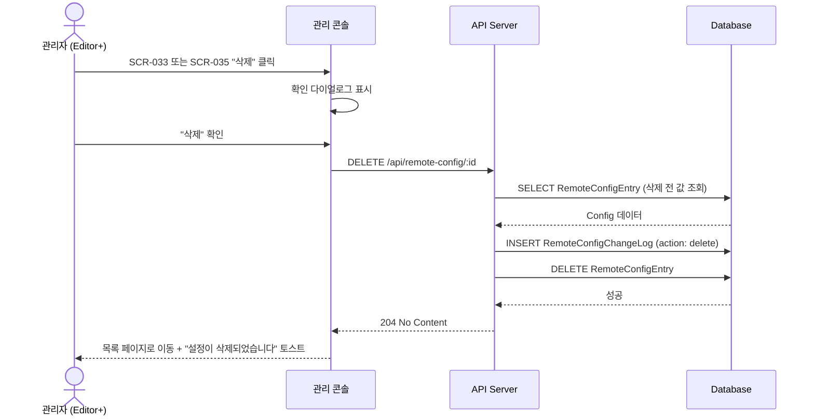
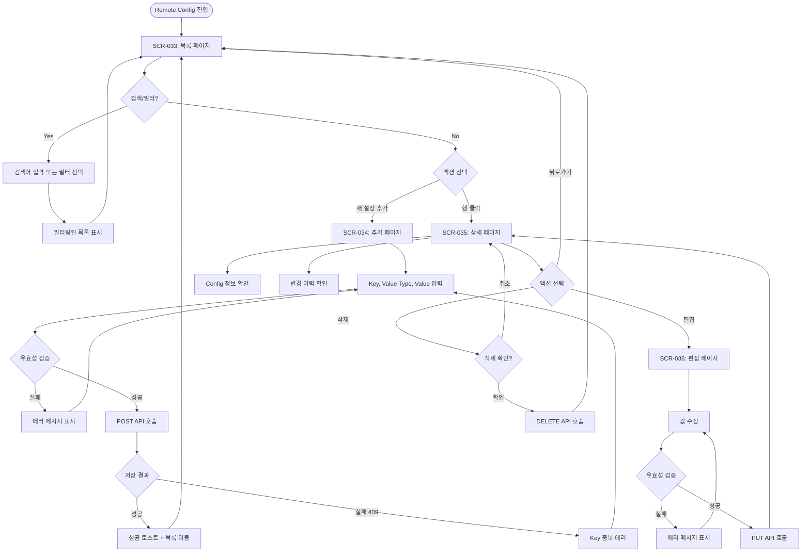

# 기획 세션: Key-Value 원격 설정 (Remote Config)

> LiveOps 관리 콘솔에서 게임 클라이언트와 서버가 참조하는 설정값을 원격으로 관리하는 Remote Config 기능의 기획 산출물(PRD, UX 스펙, 다이어그램)을 생성하는 계획을 정의한다. 플랫 Key-Value 테이블 기반의 설정 관리, 타입별 값 유효성 검증, 검색/필터/정렬, 변경 이력 추적을 포함한다.

## 문서 정보

| 항목 | 내용 |
|------|------|
| ID | SES-GLO-009 |
| 버전 | v1.0 |
| 상태 | draft |
| 작성일 | 2026-03-30 |
| 작성자 | planner |

---

## 1. 프로젝트 개요

### 1.1 목적

운영팀이 게임 클라이언트와 서버에서 참조하는 설정값을 관리 콘솔에서 원격으로 CRUD 관리할 수 있는 Remote Config 기능을 정의한다. 게임 업데이트 없이 클라이언트/서버 동작을 실시간으로 변경할 수 있어, 운영 민첩성을 극대화하는 것이 핵심 목표이다.

Remote Config는 게임 라이브옵스의 기본 인프라 기능으로, 다음과 같은 운영 시나리오를 지원한다:

- **게임 밸런스 튜닝**: 무기 데미지, 캐릭터 스탯, 드랍률 등 수치 조정
- **기능 플래그(Feature Flag)**: 신규 기능의 점진적 활성화/비활성화
- **UI 설정**: 공지 메시지, 배너 이미지 URL, 버튼 텍스트 등 클라이언트 표시 요소
- **서버 설정**: 매칭 타임아웃, 세션 만료 시간, 레이트 리밋 등 서버 파라미터
- **긴급 대응**: 장애 발생 시 특정 기능 비활성화, 점검 모드 전환

기존 F-016(웹훅/알림) 등의 이벤트 기반 시스템과 달리, Remote Config는 **상시 참조되는 정적 설정값**을 관리하는 도구이다. 조건부 딜리버리(세그먼트별 차등 값)는 범위에 포함하지 않으며, 전체 플레이어에게 동일한 값을 적용한다.

### 1.2 배경

- SES-GLO-001 킥오프에서 "리모트 컨피그(실시간 설정 변경, 세그먼트별 설정)"가 기획 범위에 포함됨
- RES-GLO-002 경쟁사 분석에서 7/7 플랫폼이 Remote Config 기능을 제공 -- 라이브옵스 플랫폼의 필수 기능
- PRD-GLO-003 A/B 테스트에서 실험 변수로 Remote Config 값을 활용하는 연동 시나리오 도출
- 경쟁사 분석 결과, 대부분의 플랫폼이 Key-Value 기반의 간단한 설정 관리에서 시작하여 조건부 딜리버리, 롤아웃 등으로 확장하는 패턴을 따름
- MVP에서는 플랫 Key-Value 테이블에 집중하고, 조건부 딜리버리는 Phase 2에서 세그멘테이션 시스템(PRD-GLO-001 F-006)과 연동하여 확장

### 1.3 설계 철학

Remote Config는 다른 LiveOps 기능(이벤트, 푸시, A/B 테스트)에 비해 **의도적으로 단순한 구조**를 채택한다.

| 설계 원칙 | 설명 | 근거 |
|-----------|------|------|
| 플랫 구조 | 중첩 없는 Key-Value 테이블, dot notation으로 네임스페이스 표현 | 복잡한 트리 구조 대비 검색/필터/정렬이 용이하고, API 응답 구조가 단순 |
| 즉시 반영 | 승인 워크플로우 없이 저장 즉시 적용 | 운영팀의 빠른 대응이 핵심 가치, 변경 이력으로 감사 추적 보장 |
| 전체 적용 | 조건부 딜리버리 없음, 모든 플레이어에게 동일 값 | MVP 복잡도 최소화, Phase 2에서 세그먼트별 오버라이드 확장 |
| 타입 안전 | Value 타입(string/number/boolean/JSON) 명시 및 유효성 검증 | 잘못된 값 입력으로 인한 장애 방지, 클라이언트/서버의 타입 기대와 일치 |

### 1.4 아키텍처

Next.js 기반 관리 콘솔에서 Key-Value 설정을 CRUD 관리하고, REST API를 통해 게임 클라이언트와 서버가 설정값을 조회한다. 설정 변경 시 변경 이력(Change Log)이 자동으로 기록되어 감사 로그 역할을 한다.

```
┌─────────────────────────────────────────────────────────────┐
│                     관리 콘솔 (Admin Console)                │
│                                                              │
│  ┌──────────────┐  ┌──────────────┐  ┌──────────────┐      │
│  │  Config 목록  │  │  Config 추가  │  │  Config 상세  │      │
│  │  (SCR-033)   │  │  (SCR-034)   │  │  (SCR-035)   │      │
│  └──────┬───────┘  └──────┬───────┘  └──────┬───────┘      │
│         │                  │                  │               │
│         └──────────────────┼──────────────────┘               │
│                            │                                  │
│                     ┌──────▼───────┐                         │
│                     │  React Query  │                         │
│                     │  + Zod 검증   │                         │
│                     └──────┬───────┘                         │
└────────────────────────────┼─────────────────────────────────┘
                             │ REST API
                    ┌────────▼────────┐
                    │    API Server    │
                    │                  │
                    │  ┌────────────┐  │
                    │  │ CRUD API   │  │
                    │  │ /api/      │  │
                    │  │ remote-    │  │
                    │  │ config     │  │
                    │  └─────┬──────┘  │
                    │        │         │
                    │  ┌─────▼──────┐  │
                    │  │ Change Log │  │
                    │  │ 자동 기록   │  │
                    │  └────────────┘  │
                    └────────┬────────┘
                             │
              ┌──────────────┼──────────────┐
              │              │              │
       ┌──────▼──────┐ ┌────▼────┐  ┌─────▼─────┐
       │ Game Client │ │  Game   │  │  Change   │
       │ (SDK 조회)  │ │ Server  │  │  Log DB   │
       └─────────────┘ └─────────┘  └───────────┘
```

### 1.5 기술 스택

| 영역 | 기술 | 용도 |
|------|------|------|
| 목록 UI | Shadcn UI (Table, Badge, Button, Input) | Config 목록 테이블, 타입 뱃지, 검색/필터 |
| 폼 UI | Shadcn UI (Form, Input, Select, Textarea) | Config 생성/편집 폼 |
| JSON 에디터 | Shadcn UI (Textarea) + JSON 유효성 검증 | JSON 타입 값 입력 시 포맷팅/검증 |
| 값 유효성 검증 | Zod | 타입별 값 검증 스키마 (string, number, boolean, JSON) |
| 폼 관리 | React Hook Form | Config 생성/편집 폼 상태 관리 |
| 데이터 패칭 | React Query | Config CRUD API 호출, 캐시 관리 |
| 테이블 | React Table | 목록 정렬, 필터, 페이지네이션 |
| 권한 제어 | useAuth + RBAC | Viewer 조회, Editor 이상 생성/수정/삭제 |

### 1.6 기존 시스템과의 관계

| 기존 시스템 | 관계 | 설명 |
|------------|------|------|
| PRD-GLO-001 세그멘테이션 | Phase 2 연동 | 세그먼트별 Config 오버라이드 (MVP 범위 외) |
| PRD-GLO-002 라이브 이벤트 | 참조 | 이벤트 설정값을 Remote Config로 관리 가능 |
| PRD-GLO-003 A/B 테스트 | Phase 2 연동 | 실험 변수로 Config 값 활용 (MVP 범위 외) |
| PRD-GLO-005 RBAC | 적용 | Viewer 조회, Editor 이상 CRUD 권한 |
| PRD-GLO-007 푸시 알림 | 독립 | 직접 연동 없음, 각각 독립 운영 |

---

## 2. 문서 ID 및 파일 체계

| 산출물 | 문서 ID | 파일명 |
|--------|---------|--------|
| PRD | PRD-GLO-008 | `docs/03-prd/2026-03-30_PRD_GLO_remote-config_v1.0.md` |
| UX 스펙 | UX-GLO-008 | `docs/05-ux/2026-03-30_UX_GLO_remote-config_v1.0.md` |
| 다이어그램 | DIA-GLO-008 | `docs/06-diagrams/2026-03-30_DIA_GLO_remote-config_v1.0.md` |

### 2.1 ID 체계 (신규)

| 항목 | ID 범위 | 비고 |
|------|---------|------|
| 기능 (Feature) | F-044 ~ F-047 | F-001~043 기존 기능 |
| 화면 (Screen) | SCR-033 ~ SCR-036 | SCR-001~032 기존 화면 |
| 다이어그램 | DIA-032 ~ DIA-034 | DIA-001~031 기존 다이어그램 (주: DIA-029~031 푸시 알림에서 번호 조정) |
| 결정사항 | D-042 ~ D-048 | D-001~041 기존 결정사항 |
| 액션아이템 | A-038 ~ A-040 | A-001~037 기존 액션아이템 |
| 미결사항 | Q-031 ~ Q-035 | Q-001~030 기존 미결사항 |

---

## 3. 참조 문서

| 문서 | 경로 | 참조 내용 |
|------|------|----------|
| 킥오프 세션 | `docs/02-planning/2026-03-05_SES_GLO_kickoff_v1.0.md` | 리모트 컨피그가 기획 범위에 포함 |
| 경쟁사 분석 | `docs/01-research/2026-03-09_RES_GLO_competitor-analysis_v1.0.md` | Remote Config 기능 벤치마킹 (7/7 플랫폼 지원) |
| A/B 테스트 PRD | PRD-GLO-003 | 실험 변수로 Config 값 활용 (Phase 2) |
| 세그멘테이션 PRD | PRD-GLO-001 | 세그먼트별 Config 오버라이드 (Phase 2) |
| 라이브 이벤트 PRD | PRD-GLO-002 | 이벤트 설정값 관리 참조 |
| RBAC PRD | PRD-GLO-005 | Viewer 조회, Editor 이상 CRUD 권한 |
| 스타일 가이드 | `shared/style-guide.md` | 문서 작성 표준 |
| 용어집 | `shared/terminology.md` | 용어 통일 |
| 네이밍 규칙 | `shared/conventions.md` | ID/파일명 규칙 |
| 리뷰 체크리스트 | `shared/review-checklist.md` | QA 기준 |

---

## 4. 실행 계획

### 4.1 실행 순서

```
Step 1: PRD 작성 (prd)               ──┐
                                       ↓
Step 2: UX 스펙 (uiux-spec)          ──┤ 병렬 실행
Step 2: 다이어그램 (diagram)          ──┤
                                       ↓
Step 3: 리뷰 (reviewer)
                                       ↓
Step 4: meta.yml 업데이트 + 커밋
```

### 4.2 Step 1: PRD 작성 (prd 에이전트)

**에이전트:** prd (Sonnet)
**산출물:** `docs/03-prd/2026-03-30_PRD_GLO_remote-config_v1.0.md`

Remote Config 4개 기능(F-044~F-047)의 요구사항을 정의한다. 기존 PRD 구조를 따르며, 데이터 모델, API 엔드포인트, RBAC 권한 매핑을 명시한다.

#### 4.2.1 기능 범위

##### F-044: 설정 키-값 CRUD (생성, 조회, 수정, 삭제)

Remote Config의 핵심 기능으로, Key-Value 설정 항목의 전체 라이프사이클을 관리한다.

**생성 (Create):**
- Key: 영문 소문자, 숫자, dot(.), underscore(_), hyphen(-) 허용
- Key 형식: dot notation 네임스페이스 (예: `game.balance.weapon_damage`, `ui.banner.main_text`)
- Key 최대 길이: 256자
- Key 중복 불가 (유니크 제약)
- Value Type 선택: string, number, boolean, JSON
- Value 입력: 타입에 따른 전용 입력 UI (F-045 참조)
- Description: 설정 항목에 대한 설명 (선택, 최대 500자)
- Target: client / server / both 중 택 1
- Tags: 분류용 태그 (선택, 복수 입력 가능)

**조회 (Read):**
- 목록 조회: 테이블 형태로 전체 Config 표시
- 상세 조회: 개별 Config의 전체 정보 + 변경 이력
- API 조회: 게임 클라이언트/서버가 REST API로 설정값 조회

**수정 (Update):**
- Value 변경: 기존 타입 유지, 값만 변경
- Value Type 변경: 타입 변경 시 기존 값 초기화 경고
- Description, Target, Tags 변경 가능
- Key 변경 불가 (삭제 후 재생성으로 대체)
- 변경 시 Change Log 자동 기록

**삭제 (Delete):**
- 소프트 삭제 또는 하드 삭제 정책 결정 필요 (Q-031 참조)
- 삭제 전 확인 다이얼로그 표시
- 삭제 시 Change Log에 삭제 이력 기록
- 삭제된 Key를 참조하는 클라이언트/서버에 대한 폴백 동작 정의 필요

**수용 기준 (Acceptance Criteria):**
- 관리자(Editor 이상)가 Key-Value 설정을 생성할 수 있다
- Key는 dot notation 네임스페이스를 지원하며 유니크해야 한다
- 생성된 설정은 즉시 API를 통해 조회 가능하다
- 수정 시 변경 전/후 값이 Change Log에 자동 기록된다
- 삭제 시 확인 다이얼로그가 표시되며, 삭제 이력이 기록된다

##### F-045: 타입별 값 입력 및 유효성 검증

각 Value Type에 대한 전용 입력 UI와 Zod 기반 유효성 검증을 제공한다.

**string 타입:**
- 입력 UI: 단일행 텍스트 입력 (Input)
- 최대 길이: 10,000자
- 유효성: 빈 문자열 허용 여부 설정 가능
- 용도: 공지 메시지, 배너 URL, 텍스트 설정

**number 타입:**
- 입력 UI: 숫자 전용 입력 (Input type="number")
- 범위: 정수 및 소수점 지원 (IEEE 754 double precision)
- 유효성: 숫자 형식 검증, NaN/Infinity 거부
- 용도: 게임 밸런스 수치, 타임아웃, 제한값

**boolean 타입:**
- 입력 UI: 토글 스위치 (Switch) 또는 Select (true/false)
- 유효성: true 또는 false만 허용
- 용도: 기능 플래그, 활성화/비활성화 설정

**JSON 타입:**
- 입력 UI: 멀티라인 텍스트 에디터 (Textarea) + JSON 구문 하이라이팅
- 유효성: JSON.parse 성공 여부, 최대 크기 50KB
- 포맷팅: 자동 정렬(prettify) 버튼 제공
- 용도: 복합 설정 (보상 테이블, 스테이지 설정, 상품 목록 등)

**타입 변경 시 동작:**
- 기존 값과 호환되지 않는 타입으로 변경 시 경고 표시
- 타입 변경 확인 후 Value 초기화 (string: "", number: 0, boolean: false, JSON: {})
- Change Log에 타입 변경 이력 기록

**Zod 스키마 예시:**

```typescript
// Config 생성 스키마
const CreateConfigSchema = z.object({
  key: z.string()
    .min(1, "Key는 필수입니다")
    .max(256, "Key는 최대 256자입니다")
    .regex(/^[a-z0-9][a-z0-9._-]*[a-z0-9]$/, "영문 소문자, 숫자, dot, underscore, hyphen만 허용"),
  valueType: z.enum(["string", "number", "boolean", "json"]),
  value: z.string(), // 서버에서 타입별 추가 검증
  description: z.string().max(500).optional(),
  target: z.enum(["client", "server", "both"]),
  tags: z.array(z.string()).optional(),
});

// 타입별 Value 검증
const StringValueSchema = z.string().max(10000);
const NumberValueSchema = z.coerce.number().finite();
const BooleanValueSchema = z.enum(["true", "false"]);
const JsonValueSchema = z.string().refine(
  (val) => { try { JSON.parse(val); return true; } catch { return false; } },
  "유효한 JSON 형식이 아닙니다"
).refine(
  (val) => new Blob([val]).size <= 50 * 1024,
  "JSON 크기는 최대 50KB입니다"
);
```

**수용 기준 (Acceptance Criteria):**
- string 타입 입력 시 최대 10,000자까지 허용된다
- number 타입 입력 시 숫자가 아닌 값은 거부된다
- boolean 타입은 토글 스위치로 true/false만 입력 가능하다
- JSON 타입 입력 시 유효하지 않은 JSON은 저장되지 않으며 오류 메시지가 표시된다
- JSON 자동 정렬(prettify) 버튼 클릭 시 포맷팅된 JSON이 표시된다
- 타입 변경 시 경고 다이얼로그가 표시되고 확인 후 값이 초기화된다

##### F-046: 검색/필터/정렬/페이지네이션

Config 목록에서 원하는 항목을 빠르게 찾고 탐색할 수 있는 기능을 제공한다.

**검색:**
- 검색 대상: Key, Description
- 검색 방식: 부분 문자열 매칭 (contains)
- 디바운스: 300ms (입력 완료 후 API 호출)
- 검색어 하이라이팅: 검색 결과에서 매칭된 부분 강조 표시

**필터:**
- Value Type 필터: string / number / boolean / JSON (다중 선택)
- Target 필터: client / server / both (다중 선택)
- Tags 필터: 태그 기반 필터링 (다중 선택)
- 네임스페이스 필터: dot notation 첫 번째 세그먼트 기준 (예: `game.*`, `ui.*`, `server.*`)
- 필터 조합: AND 조건으로 결합

**정렬:**
- 정렬 가능 컬럼: Key (기본, 오름차순), Value Type, Target, Updated At
- 정렬 방향: 오름차순(ASC) / 내림차순(DESC) 토글
- 기본 정렬: Key 오름차순

**페이지네이션:**
- 페이지 크기: 20 / 50 / 100 (기본 20)
- 페이지 네비게이션: 이전/다음 + 페이지 번호
- 전체 항목 수 표시
- URL 쿼리 파라미터로 페이지 상태 유지 (새로고침 시 복원)

**수용 기준 (Acceptance Criteria):**
- Key 또는 Description에 검색어가 포함된 항목만 표시된다
- Value Type, Target, Tags 필터를 조합하여 목록을 좁힐 수 있다
- 컬럼 헤더 클릭 시 해당 컬럼 기준으로 정렬이 변경된다
- 페이지 크기 변경 시 첫 번째 페이지로 이동한다
- 브라우저 새로고침 시 검색/필터/정렬/페이지 상태가 URL에서 복원된다

##### F-047: 변경 이력 추적 (감사 로그)

Config 항목의 모든 변경 사항을 자동으로 기록하여 감사 추적을 제공한다.

**기록 대상:**
- 생성 (create): 최초 생성 시점, 생성자, 초기 값
- 수정 (update): 변경된 필드, 변경 전/후 값, 변경자, 변경 시점
- 삭제 (delete): 삭제 시점, 삭제자, 삭제 직전 값

**기록 필드:**
- 변경 대상 필드: value, valueType, description, target, tags
- 각 필드별 이전 값(previousValue)과 새 값(newValue) 기록
- 단일 수정 요청에서 여러 필드가 변경된 경우 각각 별도 로그 항목 생성

**표시 UI:**
- Config 상세 페이지(SCR-035) 하단에 변경 이력 테이블 표시
- 시간 역순(최신순) 정렬
- 변경 유형(create/update/delete) 아이콘/뱃지 구분
- 변경자(관리자 이름) 표시
- 값 비교: 이전 값 / 새 값 나란히 표시 (diff 형태)
- JSON 타입의 경우 변경 전/후 비교 시 포맷팅된 형태로 표시

**데이터 보존:**
- 변경 이력은 삭제 불가 (불변)
- Config 항목 삭제 후에도 변경 이력은 보존
- 보존 기간: 무제한 (향후 아카이브 정책 수립 시 조정 가능)

**수용 기준 (Acceptance Criteria):**
- Config 값 변경 시 변경 전/후 값이 자동으로 기록된다
- Config 상세 페이지에서 해당 항목의 전체 변경 이력을 시간 역순으로 확인할 수 있다
- 변경 이력에는 변경자, 변경 시점, 변경 유형, 변경 필드, 이전/새 값이 포함된다
- 변경 이력은 삭제할 수 없다
- Config 항목이 삭제되어도 변경 이력은 보존된다

#### 4.2.2 데이터 모델

##### RemoteConfigEntry

| 필드 | 타입 | 제약 | 설명 |
|------|------|------|------|
| id | string (UUID) | PK, auto-generated | 고유 식별자 |
| key | string | UNIQUE, NOT NULL, max 256 | 설정 키 (dot notation) |
| valueType | enum | NOT NULL | "string" / "number" / "boolean" / "json" |
| value | string | NOT NULL | 설정 값 (모든 타입을 string으로 저장, 조회 시 타입 변환) |
| description | string | nullable, max 500 | 설정 항목 설명 |
| target | enum | NOT NULL, default "both" | "client" / "server" / "both" |
| tags | string[] | nullable | 분류용 태그 배열 |
| createdAt | datetime | NOT NULL, auto | 생성 시각 |
| createdBy | string | NOT NULL | 생성자 (관리자 ID) |
| updatedAt | datetime | NOT NULL, auto | 최종 수정 시각 |
| updatedBy | string | NOT NULL | 최종 수정자 (관리자 ID) |

##### RemoteConfigChangeLog

| 필드 | 타입 | 제약 | 설명 |
|------|------|------|------|
| id | string (UUID) | PK, auto-generated | 고유 식별자 |
| configId | string (UUID) | FK -> RemoteConfigEntry.id, NOT NULL | 대상 Config ID |
| action | enum | NOT NULL | "create" / "update" / "delete" |
| field | string | nullable | 변경된 필드명 (update 시) |
| previousValue | string | nullable | 변경 전 값 (create 시 null) |
| newValue | string | nullable | 변경 후 값 (delete 시 null) |
| changedBy | string | NOT NULL | 변경자 (관리자 ID) |
| changedAt | datetime | NOT NULL, auto | 변경 시각 |

##### 인덱스 설계

| 테이블 | 인덱스 | 용도 |
|--------|--------|------|
| RemoteConfigEntry | UNIQUE(key) | Key 중복 방지 및 Key 기반 조회 |
| RemoteConfigEntry | INDEX(target) | Target 기반 필터링 |
| RemoteConfigEntry | INDEX(valueType) | Value Type 기반 필터링 |
| RemoteConfigEntry | INDEX(updatedAt) | 최신순 정렬 |
| RemoteConfigChangeLog | INDEX(configId, changedAt DESC) | Config별 변경 이력 조회 |
| RemoteConfigChangeLog | INDEX(changedBy) | 변경자별 이력 조회 |

#### 4.2.3 API 엔드포인트

##### 목록 조회

```
GET /api/remote-config
```

**Query Parameters:**

| 파라미터 | 타입 | 기본값 | 설명 |
|---------|------|--------|------|
| search | string | - | Key, Description 검색어 |
| valueType | string | - | 콤마 구분 타입 필터 (예: "string,number") |
| target | string | - | 콤마 구분 Target 필터 (예: "client,both") |
| tags | string | - | 콤마 구분 Tags 필터 |
| namespace | string | - | 네임스페이스 필터 (dot notation 첫 세그먼트) |
| sortBy | string | "key" | 정렬 기준 (key, valueType, target, updatedAt) |
| sortOrder | string | "asc" | 정렬 방향 (asc, desc) |
| page | number | 1 | 페이지 번호 |
| pageSize | number | 20 | 페이지 크기 (20, 50, 100) |

**Response:**

```json
{
  "data": [
    {
      "id": "uuid",
      "key": "game.balance.weapon_damage",
      "valueType": "number",
      "value": "150",
      "description": "기본 무기 데미지",
      "target": "client",
      "tags": ["balance", "weapon"],
      "createdAt": "2026-03-30T10:00:00Z",
      "createdBy": "admin@example.com",
      "updatedAt": "2026-03-30T10:00:00Z",
      "updatedBy": "admin@example.com"
    }
  ],
  "pagination": {
    "page": 1,
    "pageSize": 20,
    "totalItems": 150,
    "totalPages": 8
  }
}
```

##### 상세 조회 (변경 이력 포함)

```
GET /api/remote-config/:id
```

**Response:**

```json
{
  "data": {
    "id": "uuid",
    "key": "game.balance.weapon_damage",
    "valueType": "number",
    "value": "150",
    "description": "기본 무기 데미지",
    "target": "client",
    "tags": ["balance", "weapon"],
    "createdAt": "2026-03-30T10:00:00Z",
    "createdBy": "admin@example.com",
    "updatedAt": "2026-03-30T14:30:00Z",
    "updatedBy": "editor@example.com",
    "changeLogs": [
      {
        "id": "uuid",
        "action": "update",
        "field": "value",
        "previousValue": "100",
        "newValue": "150",
        "changedBy": "editor@example.com",
        "changedAt": "2026-03-30T14:30:00Z"
      },
      {
        "id": "uuid",
        "action": "create",
        "field": null,
        "previousValue": null,
        "newValue": null,
        "changedBy": "admin@example.com",
        "changedAt": "2026-03-30T10:00:00Z"
      }
    ]
  }
}
```

##### 생성

```
POST /api/remote-config
```

**Request Body:**

```json
{
  "key": "game.balance.weapon_damage",
  "valueType": "number",
  "value": "100",
  "description": "기본 무기 데미지",
  "target": "client",
  "tags": ["balance", "weapon"]
}
```

**Response:** 201 Created (생성된 Config 객체)

**에러 케이스:**
- 400: 유효성 검증 실패 (Key 형식, Value 타입 불일치 등)
- 409: Key 중복 (이미 존재하는 Key)
- 403: 권한 부족 (Viewer 역할)

##### 수정

```
PUT /api/remote-config/:id
```

**Request Body:**

```json
{
  "value": "150",
  "description": "기본 무기 데미지 (밸런스 패치 적용)",
  "target": "client",
  "tags": ["balance", "weapon", "patch-v2"]
}
```

**Response:** 200 OK (수정된 Config 객체)

**동작:**
- 변경된 필드만 Change Log에 기록
- valueType 변경 시 value 초기화 + 별도 Change Log 기록
- Key 변경 불가 (400 에러)

##### 삭제

```
DELETE /api/remote-config/:id
```

**Response:** 204 No Content

**동작:**
- 삭제 전 Change Log에 delete 액션 기록
- Config 항목 삭제
- Change Log는 보존 (configId로 조회 가능)

#### 4.2.4 RBAC 권한 매핑

| 역할 | 조회 (GET) | 생성 (POST) | 수정 (PUT) | 삭제 (DELETE) |
|------|-----------|------------|-----------|-------------|
| Viewer | O | X | X | X |
| Editor | O | O | O | O |
| Operator | O | O | O | O |
| Admin | O | O | O | O |

#### 4.2.5 릴리즈 계획

| 릴리즈 | 기능 | 우선순위 | 비고 |
|--------|------|---------|------|
| MVP | F-044 설정 키-값 CRUD | P0 | 핵심 기능 |
| MVP | F-045 타입별 값 입력/검증 | P0 | CRUD와 함께 필수 |
| MVP | F-046 검색/필터/정렬/페이지네이션 | P0 | 운영 편의성 필수 |
| MVP | F-047 변경 이력 추적 | P0 | 감사 로그 필수 |
| v1.1 | 일괄 가져오기/내보내기 (CSV/JSON) | P1 | 대량 설정 마이그레이션 |
| v1.1 | 환경별 Config 관리 (dev/staging/prod) | P1 | 멀티 환경 지원 |
| v2.0 | 세그먼트별 조건부 딜리버리 | P2 | PRD-GLO-001 연동 |
| v2.0 | A/B 테스트 변수 연동 | P2 | PRD-GLO-003 연동 |
| v2.0 | Config 롤아웃 (점진적 적용) | P2 | 점진적 배포 |

**검증:** PRD-GLO-005(RBAC) 권한 모델과의 일관성, 데이터 모델 필드와 API 응답 구조의 정합성

### 4.3 Step 2: UX 스펙 작성 (uiux-spec 에이전트) -- Step 1 완료 후

**에이전트:** uiux-spec (Sonnet)
**산출물:** `docs/05-ux/2026-03-30_UX_GLO_remote-config_v1.0.md`

Remote Config 관리 화면 정의서를 작성한다. 기존 목록/상세/생성/편집 패턴을 따르되, 타입별 값 입력 UI와 변경 이력 표시에 대한 인터랙션을 상세히 정의한다.

#### 4.3.1 화면 정의서 구조

##### SCR-033: Remote Config 목록 페이지 (`/remote-config`)

**레이아웃:**
- 상단: 페이지 제목("Remote Config") + 설명 텍스트 + "새 설정 추가" 버튼
- 검색/필터 영역: 검색 입력, Value Type 필터, Target 필터, Tags 필터
- 데이터 테이블: Key, Value (타입 뱃지 포함), Target, Tags, Updated At, Actions

**테이블 컬럼:**

| 컬럼 | 너비 | 정렬 | 설명 |
|------|------|------|------|
| Key | 30% | 오름차순(기본) | dot notation 표시, 네임스페이스 부분 회색 |
| Value | 25% | - | 타입 뱃지(string/number/boolean/JSON) + 값 미리보기 (truncate) |
| Target | 10% | 가능 | client/server/both 뱃지 |
| Tags | 15% | - | 태그 칩 (최대 3개, 초과 시 "+N" 표시) |
| Updated | 10% | 가능 | 상대 시간 (예: "2시간 전") |
| Actions | 10% | - | 편집, 삭제 아이콘 버튼 |

**Value 미리보기 규칙:**
- string: 최대 50자, 초과 시 "..." 말줄임
- number: 숫자 그대로 표시
- boolean: "true" / "false" 뱃지 (녹색/회색)
- JSON: `{...}` 축약 표시, 호버 시 포맷팅된 JSON 툴팁

**상태 정의:**

| 상태 | 조건 | 표시 |
|------|------|------|
| Default | 1개 이상 Config 존재 | 테이블 + 페이지네이션 |
| Empty | Config 0개 | 빈 상태 일러스트 + "첫 번째 설정을 추가해보세요" 안내 + CTA 버튼 |
| Loading | API 호출 중 | 테이블 스켈레톤 로딩 |
| Error | API 오류 | 에러 메시지 + 재시도 버튼 |
| Search Empty | 검색/필터 결과 0건 | "검색 결과가 없습니다" + 필터 초기화 링크 |

**인터랙션:**

| ID | 트리거 | 동작 |
|----|--------|------|
| INT-033-01 | "새 설정 추가" 버튼 클릭 | `/remote-config/new`로 이동 |
| INT-033-02 | 테이블 행 클릭 | `/remote-config/[id]` 상세 페이지로 이동 |
| INT-033-03 | 검색 입력 | 300ms 디바운스 후 API 호출, URL 쿼리 업데이트 |
| INT-033-04 | 필터 변경 | 즉시 API 호출, 페이지 1로 리셋, URL 쿼리 업데이트 |
| INT-033-05 | 컬럼 헤더 클릭 | 정렬 방향 토글 (ASC <-> DESC), URL 쿼리 업데이트 |
| INT-033-06 | 페이지 크기 변경 | 페이지 1로 리셋, URL 쿼리 업데이트 |
| INT-033-07 | 삭제 아이콘 클릭 | 확인 다이얼로그 표시 ("정말 삭제하시겠습니까?") |
| INT-033-08 | 삭제 확인 | DELETE API 호출, 성공 시 목록 갱신 + 토스트 알림 |
| INT-033-09 | 편집 아이콘 클릭 | `/remote-config/[id]/edit`로 이동 |
| INT-033-10 | 브라우저 뒤로가기/새로고침 | URL 쿼리에서 검색/필터/정렬/페이지 상태 복원 |

##### SCR-034: Remote Config 추가 페이지 (`/remote-config/new`)

**레이아웃:**
- 상단: 페이지 제목("새 설정 추가") + 뒤로가기 링크
- 폼 영역: Key, Value Type, Value, Description, Target, Tags 입력
- 하단: "취소" + "저장" 버튼

**폼 필드:**

| 필드 | 컴포넌트 | 필수 | 유효성 검증 |
|------|---------|------|------------|
| Key | Input | O | 영문 소문자/숫자/dot/underscore/hyphen, 1~256자, 중복 불가 |
| Value Type | Select | O | string/number/boolean/json 중 택 1 |
| Value | 타입별 동적 UI | O | F-045 검증 규칙 적용 |
| Description | Textarea | X | 최대 500자 |
| Target | Select | O | client/server/both (기본: both) |
| Tags | Tag Input | X | 콤마 또는 엔터로 구분, 자동완성 (기존 태그) |

**타입별 Value 입력 UI:**
- Value Type 선택에 따라 Value 입력 컴포넌트가 동적으로 변경
- string: `<Input />` (단일행)
- number: `<Input type="number" />` (숫자 전용)
- boolean: `<Switch />` (토글) + "true"/"false" 라벨
- json: `<Textarea />` (멀티라인, 모노스페이스 폰트) + "포맷팅" 버튼

**상태 정의:**

| 상태 | 조건 | 표시 |
|------|------|------|
| Default | 페이지 진입 | 빈 폼, Value Type 기본값 "string" |
| Validating | 필드 입력 중 | 실시간 유효성 검증 메시지 |
| Submitting | "저장" 클릭 후 | 버튼 로딩 상태, 폼 비활성화 |
| Error | API 오류 | 에러 메시지 (Key 중복 등) |
| Success | 저장 완료 | 목록 페이지로 이동 + 토스트 알림 |

**인터랙션:**

| ID | 트리거 | 동작 |
|----|--------|------|
| INT-034-01 | Value Type 변경 | Value 입력 컴포넌트 교체, 기존 Value 초기화 |
| INT-034-02 | Key 입력 (blur) | 중복 검사 API 호출, 중복 시 에러 메시지 |
| INT-034-03 | JSON Value 입력 후 "포맷팅" 클릭 | JSON.parse 후 2-space indent 적용 |
| INT-034-04 | "저장" 클릭 | Zod 유효성 검증 -> POST API 호출 -> 성공 시 목록으로 이동 |
| INT-034-05 | "취소" 클릭 | 변경 사항 있을 시 확인 다이얼로그, 없으면 즉시 목록으로 이동 |
| INT-034-06 | Tags 입력 시 자동완성 | 기존 태그 목록에서 매칭되는 항목 드롭다운 표시 |

##### SCR-035: Remote Config 상세 페이지 (`/remote-config/[id]`)

**레이아웃:**
- 상단: 뒤로가기 링크 + Key 표시 (H1) + 타입 뱃지 + "편집" / "삭제" 버튼
- 정보 섹션: Key, Value, Value Type, Description, Target, Tags, Created/Updated 정보
- 변경 이력 섹션: Change Log 테이블

**정보 표시:**

| 항목 | 표시 방식 |
|------|----------|
| Key | 모노스페이스 폰트, dot notation 네임스페이스 부분 회색 |
| Value Type | 타입 뱃지 (색상 구분: string=파란색, number=주황색, boolean=녹색, JSON=보라색) |
| Value | 타입별 포맷팅 (string: 텍스트, number: 숫자, boolean: true/false 뱃지, JSON: 코드 블록) |
| Description | 텍스트 (없으면 "설명 없음" 회색 텍스트) |
| Target | client/server/both 뱃지 |
| Tags | 태그 칩 목록 |
| Created | "YYYY-MM-DD HH:mm" + 생성자 |
| Updated | "YYYY-MM-DD HH:mm" + 수정자 + 상대 시간 |

**변경 이력 테이블:**

| 컬럼 | 설명 |
|------|------|
| 시각 | "YYYY-MM-DD HH:mm:ss" |
| 유형 | create/update/delete 뱃지 |
| 필드 | 변경된 필드명 (create/delete 시 "-") |
| 이전 값 | 변경 전 값 (create 시 "-") |
| 새 값 | 변경 후 값 (delete 시 "-") |
| 변경자 | 관리자 이름/이메일 |

**상태 정의:**

| 상태 | 조건 | 표시 |
|------|------|------|
| Default | 정상 조회 | Config 정보 + 변경 이력 |
| Loading | API 호출 중 | 스켈레톤 로딩 |
| Error | API 오류 또는 404 | 에러 메시지 + 목록으로 돌아가기 링크 |
| No History | 변경 이력 없음 (생성 직후) | "변경 이력이 없습니다" 안내 |

**인터랙션:**

| ID | 트리거 | 동작 |
|----|--------|------|
| INT-035-01 | "편집" 버튼 클릭 | `/remote-config/[id]/edit`로 이동 |
| INT-035-02 | "삭제" 버튼 클릭 | 확인 다이얼로그 표시, 확인 시 DELETE API -> 목록으로 이동 |
| INT-035-03 | JSON Value 영역 | 코드 블록 내 구문 하이라이팅 + "복사" 버튼 |
| INT-035-04 | 변경 이력 행 호버 | 전체 값 툴팁 표시 (긴 값의 경우) |

##### SCR-036: Remote Config 편집 페이지 (`/remote-config/[id]/edit`)

**레이아웃:**
- SCR-034(추가 페이지)와 동일한 폼 구조
- Key 필드는 읽기 전용 (수정 불가, 회색 배경)
- 기존 값이 폼에 미리 채워진 상태

**SCR-034와의 차이점:**

| 항목 | SCR-034 (추가) | SCR-036 (편집) |
|------|---------------|---------------|
| 페이지 제목 | "새 설정 추가" | "설정 편집" |
| Key 필드 | 입력 가능 | 읽기 전용 |
| 폼 초기값 | 빈 폼 | 기존 Config 값 로드 |
| 저장 API | POST /api/remote-config | PUT /api/remote-config/:id |
| 저장 후 이동 | 목록 페이지 | 상세 페이지 |

**인터랙션:**

| ID | 트리거 | 동작 |
|----|--------|------|
| INT-036-01 | Value Type 변경 | 경고 다이얼로그("타입을 변경하면 기존 값이 초기화됩니다"), 확인 시 Value 초기화 |
| INT-036-02 | "저장" 클릭 | 변경 사항 비교, 변경된 필드만 PUT API 전송 -> 상세 페이지로 이동 |
| INT-036-03 | "취소" 클릭 | 변경 사항 있을 시 확인 다이얼로그, 없으면 상세 페이지로 이동 |
| INT-036-04 | 페이지 로드 | GET API로 기존 Config 조회 -> 폼에 값 채우기 |

**검증:** 모든 화면에 Default/Empty/Loading/Error 상태 정의, 인터랙션 ID 연속성, 기존 목록/상세/생성/편집 패턴과의 일관성

### 4.4 Step 2: 다이어그램 작성 (diagram 에이전트) -- Step 1 완료 후, UX 스펙과 병렬

**에이전트:** diagram (Sonnet)
**산출물:** `docs/06-diagrams/2026-03-30_DIA_GLO_remote-config_v1.0.md`

Remote Config 다이어그램을 Mermaid로 작성한다.

#### 4.4.1 다이어그램 목록

##### DIA-032: Remote Config 데이터 모델 (ERD)

RemoteConfigEntry와 RemoteConfigChangeLog 엔티티의 관계를 정의한다.



**포함 사항:**
- RemoteConfigEntry: 설정 항목 엔티티
- RemoteConfigChangeLog: 변경 이력 엔티티
- Admin: 관리자 엔티티 (PRD-GLO-005 RBAC 참조)
- 1:N 관계: RemoteConfigEntry -> RemoteConfigChangeLog
- 1:N 관계: Admin -> RemoteConfigEntry (createdBy, updatedBy)
- 1:N 관계: Admin -> RemoteConfigChangeLog (changedBy)

##### DIA-033: CRUD 시퀀스 다이어그램

Config 항목의 생성, 조회, 수정, 삭제 시퀀스를 정의한다.

**생성 시퀀스:**



**수정 시퀀스:**



**삭제 시퀀스:**



##### DIA-034: 사용자 플로우

관리자가 Remote Config를 관리하는 전체 사용자 플로우를 정의한다.



**검증:** Mermaid 문법 렌더링 확인, PRD 데이터 모델과의 정합성, API 엔드포인트와의 일관성

### 4.5 Step 3: 리뷰 (reviewer 에이전트)

**에이전트:** reviewer (Sonnet)
**산출물:** `docs/07-reviews/2026-03-30_REV_GLO_remote-config_v1.0.md`

PRD, UX 스펙, 다이어그램 3개 문서를 `shared/review-checklist.md` 기준으로 검토한다.

**검토 범위:**

| 검토 항목 | 대상 문서 | 검증 내용 |
|----------|----------|----------|
| YAML front matter | 전체 | 필수 필드 존재, 상태/버전 규칙 준수 |
| 기능 ID 추적 | PRD -> UX, DIA | F-044~F-047이 모든 문서에 반영되었는지 |
| 화면 ID 추적 | UX -> PRD | SCR-033~SCR-036이 PRD 기능과 매핑되는지 |
| 다이어그램 ID 추적 | DIA -> PRD | DIA-032~DIA-034가 PRD 데이터 모델/플로우와 일치하는지 |
| 용어 일관성 | 전체 | `shared/terminology.md` 기준 용어 통일 |
| 데이터 모델 정합성 | PRD <-> DIA | RemoteConfigEntry, RemoteConfigChangeLog 필드 일치 |
| API 정합성 | PRD <-> UX | API 엔드포인트와 화면 인터랙션 매칭 |
| RBAC 정합성 | PRD | PRD-GLO-005 역할별 권한과 일치 |
| 상태 정의 | UX | 모든 화면에 Default/Empty/Loading/Error 상태 존재 |
| Mermaid 문법 | DIA | 렌더링 오류 없음 |

**교차 문서 검증 매트릭스:**

| 기능 | PRD | UX 화면 | 다이어그램 |
|------|-----|---------|-----------|
| F-044 CRUD | O | SCR-033, SCR-034, SCR-035, SCR-036 | DIA-032 (ERD), DIA-033 (시퀀스), DIA-034 (플로우) |
| F-045 타입 검증 | O | SCR-034 (타입별 UI), SCR-036 (편집) | DIA-032 (valueType enum) |
| F-046 검색/필터 | O | SCR-033 (검색/필터 영역) | DIA-034 (검색 플로우) |
| F-047 변경 이력 | O | SCR-035 (이력 테이블) | DIA-032 (ChangeLog ERD), DIA-033 (이력 기록 시퀀스) |

### 4.6 Step 4: meta.yml 업데이트

모든 문서 승인 완료 후 `docs/meta.yml`에 PRD-GLO-008, UX-GLO-008, DIA-GLO-008 문서 정보를 추가한다.

```yaml
# 추가할 항목
documents:
  - id: "PRD-GLO-008"
    title: "PRD: Key-Value 원격 설정 (Remote Config)"
    path: "docs/03-prd/2026-03-30_PRD_GLO_remote-config_v1.0.md"
    status: "approved"

  - id: "UX-GLO-008"
    title: "화면정의서: Remote Config"
    path: "docs/05-ux/2026-03-30_UX_GLO_remote-config_v1.0.md"
    status: "approved"

  - id: "DIA-GLO-008"
    title: "다이어그램: Remote Config"
    path: "docs/06-diagrams/2026-03-30_DIA_GLO_remote-config_v1.0.md"
    status: "approved"
```

---

## 5. 결정 사항

| ID | 결정 내용 | 근거 |
|----|----------|------|
| D-042 | 플랫 Key-Value 구조 채택, 중첩 객체/트리 구조 미사용 | 검색/필터/정렬이 용이하고 API 응답 구조가 단순함. dot notation 네임스페이스로 논리적 그룹핑 가능. 경쟁사(Firebase Remote Config, PlayFab) 대부분 플랫 구조 채택 |
| D-043 | 승인 워크플로우 없이 즉시 반영 | Remote Config는 긴급 대응(장애 시 기능 플래그 OFF)이 핵심 사용 시나리오이므로 승인 지연 불가. 변경 이력(Change Log)으로 감사 추적 보장. 라이브 이벤트(PRD-GLO-002)와 달리 전체 적용이므로 오적용 영향 범위가 명확 |
| D-044 | 조건부 딜리버리(세그먼트별 차등 값)는 MVP 범위 외, Phase 2에서 구현 | MVP 복잡도 최소화. 세그멘테이션 시스템(PRD-GLO-001 F-006)과의 연동 설계가 필요하며, 기본 CRUD가 안정화된 후 확장하는 것이 리스크 최소화 |
| D-045 | Value는 모든 타입을 string으로 직렬화하여 저장, 조회 시 valueType 기반으로 파싱/변환 | DB 스키마 단순화. 단일 value 컬럼으로 모든 타입 처리 가능. 타입별 별도 컬럼(string_value, number_value 등) 대비 마이그레이션 용이 |
| D-046 | Key 변경 불가, 삭제 후 재생성으로 대체 | Key는 클라이언트/서버 코드에서 하드코딩되어 참조되므로, Key 변경 시 참조 무결성 파괴 위험. Change Log의 configId 기반 이력 추적도 Key 불변성에 의존 |
| D-047 | JSON Value 최대 크기 50KB | 대용량 JSON은 별도 CDN/스토리지로 관리해야 하며, Remote Config는 설정값 관리 도구로서 적절한 크기 제한 필요. 50KB는 복잡한 보상 테이블, 스테이지 설정 등을 충분히 포함 가능 |
| D-048 | 변경 이력(Change Log) 무제한 보존, 삭제 불가 | 감사 로그 목적이므로 불변성 보장 필수. Config 항목 삭제 후에도 이력 보존. 향후 아카이브 정책(예: 1년 이상 이력 콜드 스토리지 이전) 수립 시 조정 가능 |

---

## 6. 액션 아이템

| ID | 내용 | 담당 | 상태 |
|----|------|------|------|
| A-038 | PRD-GLO-008 Remote Config PRD 작성: CRUD, 타입별 검증, 검색/필터, 변경 이력 4개 기능 정의 | prd | pending |
| A-039 | UX-GLO-008 Remote Config 화면 정의서 작성: 목록, 추가, 상세, 편집 4개 화면 | uiux-spec | pending |
| A-040 | DIA-GLO-008 Remote Config 다이어그램 작성: ERD, CRUD 시퀀스, 사용자 플로우 3개 다이어그램 | diagram | pending |

---

## 7. 미결 사항

| ID | 질문 | 상태 |
|----|------|------|
| Q-031 | Config 삭제 정책 -- 소프트 삭제(is_deleted 플래그) vs 하드 삭제? 소프트 삭제 시 삭제된 항목 복원 UI 필요 여부는? | open |
| Q-032 | Config 일괄 가져오기/내보내기 (CSV/JSON) 포맷 -- v1.1에서 제공 예정이나, 데이터 마이그레이션 시나리오 확정 필요. 환경 간(dev->staging->prod) 복사 워크플로우는? | open |
| Q-033 | 게임 클라이언트/서버 SDK의 Config 캐싱 전략 -- 폴링 주기(기본 5분?), ETag 기반 조건부 요청 지원 여부, Config 변경 시 실시간 푸시(WebSocket) 필요 여부 | open |
| Q-034 | Config 항목 수 상한 -- 프로젝트당 최대 Config 수 제한 필요 여부. 제한 없을 경우 검색/필터 성능 영향 범위는? (1,000개? 10,000개?) | open |
| Q-035 | 환경별 Config 관리(dev/staging/prod) 아키텍처 -- v1.1에서 제공 예정이나, 환경 간 Config 동기화 메커니즘과 환경별 접근 제어 설계 필요 | open |

---

## 8. 검증 기준

- 모든 문서가 `shared/style-guide.md` YAML front matter 규칙을 따르는지 확인
- 기능 ID(F-044~F-047), 화면 ID(SCR-033~036), 다이어그램 ID(DIA-032~034)가 기존 체계와 연속적인지 확인
- PRD-GLO-005(RBAC)의 Viewer/Editor 역할 권한과 Config CRUD 접근 제어의 일관성 확인
- 데이터 모델(RemoteConfigEntry, RemoteConfigChangeLog)이 PRD와 다이어그램에서 동일한 필드/타입/제약을 정의하는지 확인
- API 엔드포인트(GET/POST/PUT/DELETE /api/remote-config)와 UX 인터랙션(INT-xxx)이 1:1 매핑되는지 확인
- 4개 화면(SCR-033~036) 모두 Default/Empty/Loading/Error 상태가 정의되었는지 확인
- Zod 스키마가 API 요청/응답 구조와 일치하는지 확인
- 변경 이력(F-047)이 모든 CRUD 시퀀스(DIA-033)에 포함되었는지 확인
- 릴리즈 계획(MVP/v1.1/v2.0) 기능 분배가 의존성과 부합하는지 확인

---

## 기능 목록

| ID | 기능명 | 설명 | 릴리즈 | 우선순위 |
|----|--------|------|--------|---------|
| F-044 | 설정 키-값 CRUD | Key-Value 설정 항목의 생성, 조회, 수정, 삭제. dot notation 네임스페이스, Key 유니크 제약, 즉시 반영 | MVP | P0 |
| F-045 | 타입별 값 입력 및 유효성 검증 | string(10,000자), number(IEEE 754), boolean(토글), JSON(50KB, 포맷팅) 타입별 전용 입력 UI와 Zod 기반 검증 | MVP | P0 |
| F-046 | 검색/필터/정렬/페이지네이션 | Key/Description 검색, Value Type/Target/Tags/네임스페이스 필터, 컬럼 정렬, 페이지 크기 20/50/100, URL 상태 유지 | MVP | P0 |
| F-047 | 변경 이력 추적 | create/update/delete 액션별 필드 단위 변경 이력 자동 기록, 불변 보존, Config 상세 페이지에서 시간 역순 표시 | MVP | P0 |

---

## 화면 목록

| ID | 화면명 | 경로 | 주요 기능 |
|----|--------|------|----------|
| SCR-033 | Remote Config 목록 | `/remote-config` | Config 테이블, 검색/필터/정렬, 페이지네이션, 삭제 |
| SCR-034 | Remote Config 추가 | `/remote-config/new` | Config 생성 폼, 타입별 Value 입력, Zod 검증 |
| SCR-035 | Remote Config 상세 | `/remote-config/[id]` | Config 정보 표시, 변경 이력 테이블 |
| SCR-036 | Remote Config 편집 | `/remote-config/[id]/edit` | Config 수정 폼, Key 읽기 전용, 타입 변경 경고 |

---

## 다이어그램 목록

| ID | 다이어그램명 | 유형 | 설명 |
|----|------------|------|------|
| DIA-032 | Remote Config 데이터 모델 | ERD | RemoteConfigEntry, RemoteConfigChangeLog, Admin 엔티티 및 관계 |
| DIA-033 | CRUD 시퀀스 | 시퀀스 다이어그램 | 생성, 수정, 삭제 시 관리자-UI-API-DB 간 상호작용 흐름 |
| DIA-034 | 사용자 플로우 | 플로우차트 | 관리자의 Remote Config 전체 관리 플로우 (목록-추가-상세-편집-삭제) |

---

## 변경 이력

| 버전 | 날짜 | 변경 내용 | 작성자 |
|------|------|----------|--------|
| v1.0 | 2026-03-30 | Key-Value 원격 설정 (Remote Config) 기획 세션 문서 최초 작성 | planner |
