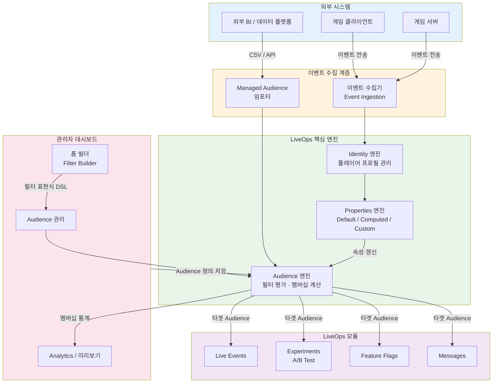
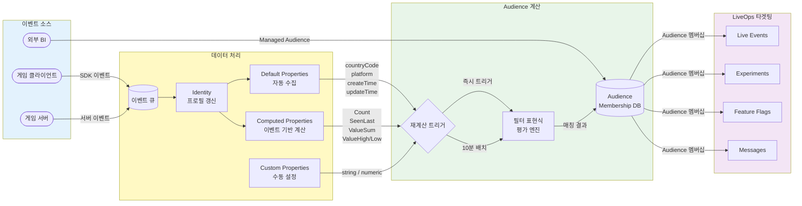
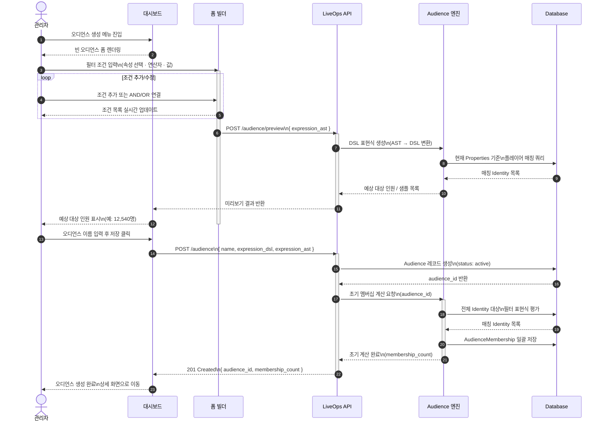
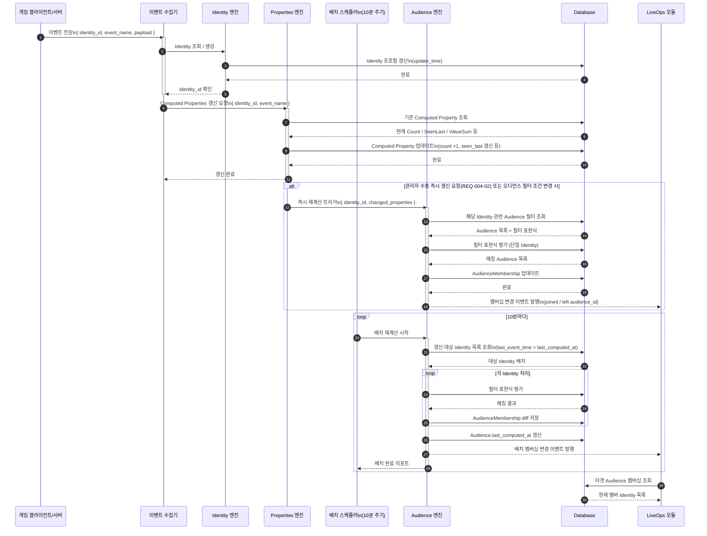
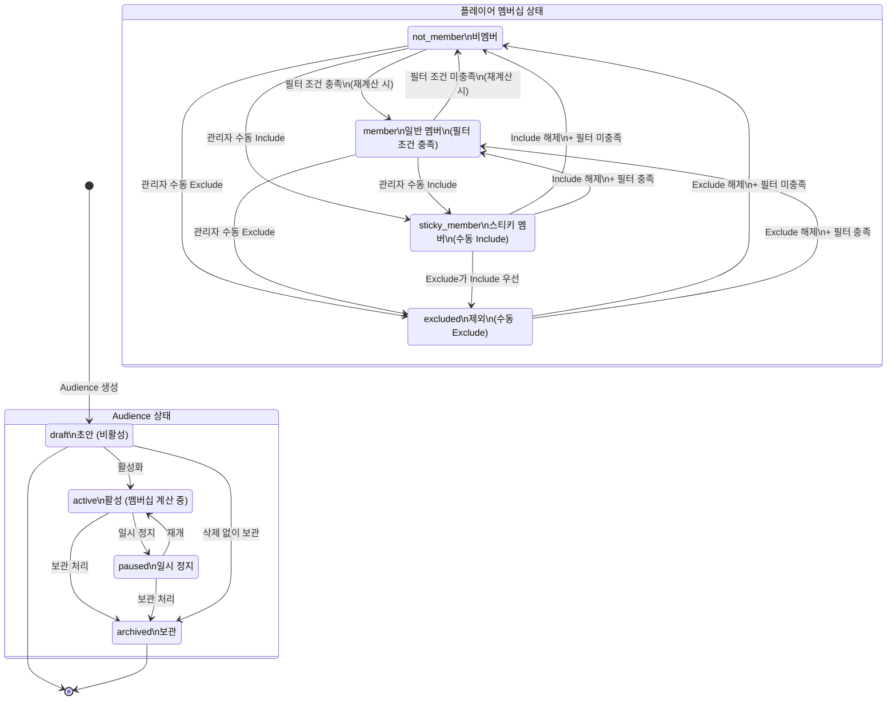
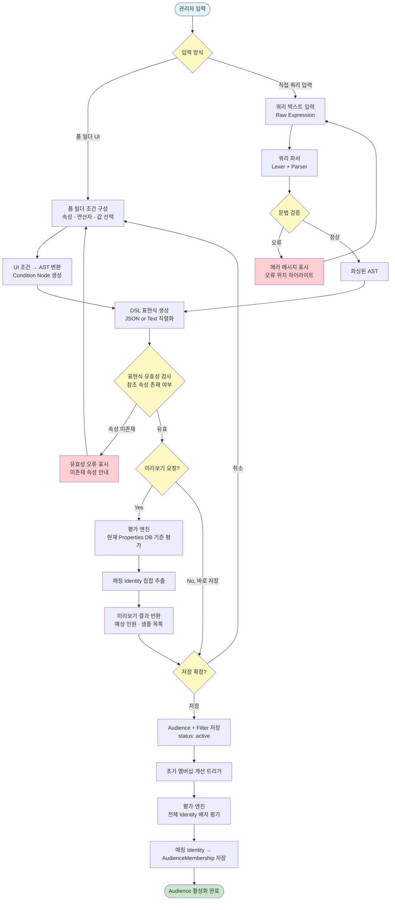

# 다이어그램: 플레이어 세그멘테이션

> Game LiveOps Service의 플레이어 세그멘테이션 시스템 전체 구조, 데이터 흐름, 엔티티 관계, 주요 시퀀스, 상태 전이, 필터 처리 흐름을 시각화한 다이어그램 문서.

## 문서 정보

| 항목 | 내용 |
|------|------|
| 문서 ID | DIA-GLO-001 |
| 버전 | v1.0 |
| 상태 | draft |
| 작성일 | 2026-03-10 |
| 작성자 | diagram |
| 관련 PRD | PRD-GLO-001 |
| 관련 UX | UX-GLO-001 |
| 참조 리서치 | RES-GLO-003 |

---

## DIA-001: 시스템 아키텍처

### 설명

플레이어 세그멘테이션 시스템의 전체 컴포넌트 구성과 계층별 역할을 나타낸다. 게임 클라이언트/서버로부터 이벤트를 수집하여 Identity 프로필을 구성하고, Properties를 갱신하며, Audience를 계산하여 LiveOps 모듈에 타겟팅 정보를 제공하는 흐름을 보여준다. 외부 BI 시스템을 통한 Managed Audience 주입 경로도 포함한다.

> **화면 매핑**: 폼 빌더 → SCR-002, Audience 관리 → SCR-001/SCR-003, Analytics → SCR-003, 속성 관리 → SCR-004, 이벤트 택소노미 → SCR-005

---

## DIA-002: 데이터 흐름 다이어그램

### 설명

이벤트 전송부터 LiveOps 타겟팅 적용까지의 end-to-end 데이터 흐름을 나타낸다. Properties 3종(Default / Computed / Custom)의 갱신 경로, Audience 재계산 주기(10분 배치 또는 즉시), 외부 BI를 통한 Managed Audience 주입 경로를 모두 포함한다.

---

## DIA-003: ERD (Entity Relationship Diagram)

### 설명

플레이어 세그멘테이션 시스템의 핵심 엔티티와 관계를 나타낸다. Identity를 중심으로 Default / Computed / Custom Properties가 연결되고, Audience는 AudienceFilter로 정의되며 AudienceMembership을 통해 Identity와 연결된다. LiveEvent, Experiment, FeatureFlag, Message는 모두 Audience를 타겟팅 단위로 참조한다.

```mermaid
erDiagram
    IDENTITY ||--|| DEFAULT_PROPERTY : has
    IDENTITY ||--o{ COMPUTED_PROPERTY : has
    IDENTITY ||--o{ CUSTOM_PROPERTY : has
    IDENTITY ||--o{ EVENT : generates
    IDENTITY ||--o{ AUDIENCE_MEMBERSHIP : belongs_to

    IDENTITY {
        string id PK
        string user_id
        string environment_id FK
        datetime created_at
        datetime updated_at
    }

    DEFAULT_PROPERTY {
        string id PK
        string identity_id FK
        string country_code
        string platform
        datetime create_time
        datetime update_time
    }

    COMPUTED_PROPERTY {
        string id PK
        string identity_id FK
        string event_name
        int count
        datetime seen_last
        decimal value_sum
        decimal value_high
        decimal value_low
        datetime computed_at
    }

    CUSTOM_PROPERTY {
        string id PK
        string identity_id FK
        string key
        string value_type
        string string_value
        decimal numeric_value
        datetime updated_at
    }

    EVENT {
        string id PK
        string identity_id FK
        string event_name
        json payload
        datetime received_at
    }

    AUDIENCE ||--o{ AUDIENCE_FILTER : defined_by
    AUDIENCE ||--o{ AUDIENCE_MEMBERSHIP : contains
    AUDIENCE ||--o{ AUDIENCE_OVERRIDE : has

    AUDIENCE {
        string id PK
        string name
        string description
        string status
        string environment_id FK
        datetime created_at
        datetime updated_at
        datetime last_computed_at
    }

    AUDIENCE_FILTER {
        string id PK
        string audience_id FK
        string expression_dsl
        string expression_ast
        int version
        datetime created_at
    }

    AUDIENCE_MEMBERSHIP {
        string id PK
        string audience_id FK
        string identity_id FK
        string membership_type
        datetime joined_at
        datetime expires_at
    }

    AUDIENCE_OVERRIDE {
        string id PK
        string audience_id FK
        string identity_id FK
        string override_type
        string reason
        datetime created_at
    }

    AUDIENCE ||--o{ LIVE_EVENT : targeted_by
    AUDIENCE ||--o{ EXPERIMENT : targeted_by
    AUDIENCE ||--o{ FEATURE_FLAG : targeted_by
    AUDIENCE ||--o{ MESSAGE : targeted_by

    LIVE_EVENT {
        string id PK
        string audience_id FK
        string name
        string status
        datetime start_at
        datetime end_at
    }

    EXPERIMENT {
        string id PK
        string audience_id FK
        string name
        string status
        float rollout_percentage
    }

    FEATURE_FLAG {
        string id PK
        string audience_id FK
        string key
        boolean enabled
        json variants
    }

    MESSAGE {
        string id PK
        string audience_id FK
        string channel
        string content
        datetime scheduled_at
    }

    EVENT_TAXONOMY {
        string event_name PK
        string display_name
        string description
        string category
        jsonb parameters_schema
        timestamp created_at
        timestamp updated_at
    }
    COMPUTED_PROPERTY_RULE {
        string id PK
        string property_key FK
        string event_name FK
        string aggregation_type
        string parameter_name
        timestamp created_at
    }
    EVENT_TAXONOMY ||--o{ COMPUTED_PROPERTY_RULE : "triggers"
    COMPUTED_PROPERTY_RULE }o--|| COMPUTED_PROPERTY : "updates"
```

---

## DIA-004: 오디언스 생성 시퀀스 다이어그램

### 설명

관리자가 대시보드에서 오디언스를 생성하는 전체 시퀀스를 나타낸다. 폼 빌더에서 필터 조건을 구성하고 DSL 표현식을 생성한 후, 미리보기로 예상 대상 인원을 확인하고, 저장 시 초기 멤버십 계산이 트리거되는 흐름을 포함한다.

---

## DIA-005: 오디언스 멤버십 갱신 시퀀스 다이어그램

### 설명

게임 이벤트 수신 후 Computed Properties가 갱신되고, 주기적 배치(10분) 또는 즉시 트리거로 Audience 멤버십이 재계산되어 LiveOps 모듈에 반영되는 흐름을 나타낸다. 멤버십 변경(신규 진입 / 이탈) 시 알림 이벤트가 발행된다.

---

## DIA-006: 상태 다이어그램

### 설명

Audience 엔티티의 상태 전환(`draft` → `active` → `paused` → `archived`)과 플레이어의 Audience 멤버십 상태 전환(`not_member` → `member` → `sticky_member` → `excluded`)을 나타낸다. Include/Exclude 수동 오버라이드를 통한 강제 전환 경로를 포함한다.

> **참고**: SES-GLO-004에서는 active/expired/sticky 3상태로 기술되었으나, PRD F-004의 상세 요구사항을 반영하여 not_member/member/sticky_member/excluded 4상태로 확장 정의함

---

## DIA-007: 필터 표현식 처리 흐름

### 설명

관리자가 폼 빌더 UI 또는 쿼리 직접 입력으로 필터 조건을 정의하면, 이를 AST(Abstract Syntax Tree)로 변환하고 DSL 표현식을 생성하여 평가 엔진에서 플레이어 매칭을 수행하는 흐름을 나타낸다. 문법 오류 발생 시의 에러 처리 경로도 포함한다.

---

## 변경 이력

| 버전 | 일자 | 변경 내용 | 작성자 |
|------|------|-----------|--------|
| v1.0 | 2026-03-10 | 초안 작성 - 7종 다이어그램 (아키텍처, 데이터 흐름, ERD, 시퀀스 2종, 상태, 필터 흐름) | diagram |
| v1.1 | 2026-03-26 | REV-GLO-003 리뷰 반영: ERD에 EVENT_TAXONOMY/COMPUTED_PROPERTY_RULE 추가, 화면 매핑 보완, 즉시 재계산 조건 명시, 멤버십 상태 차이 설명 추가 | diagram |
