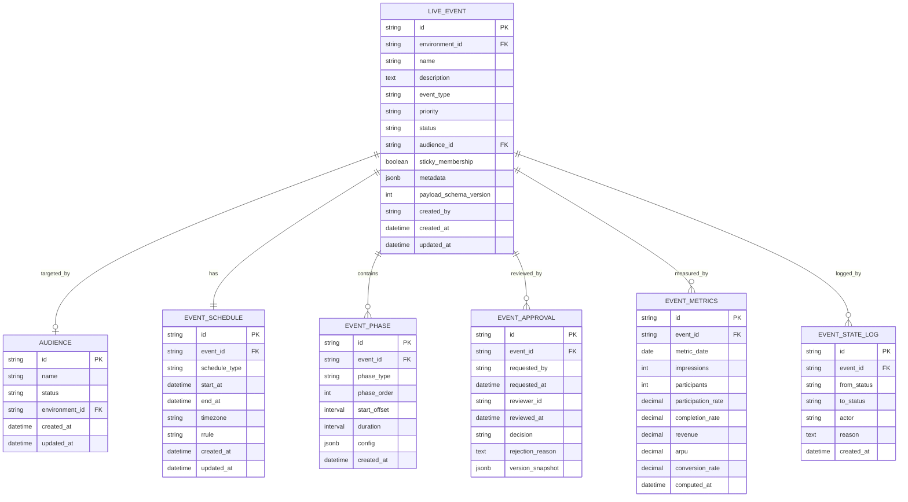
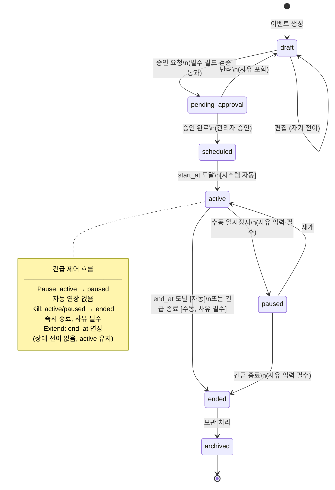
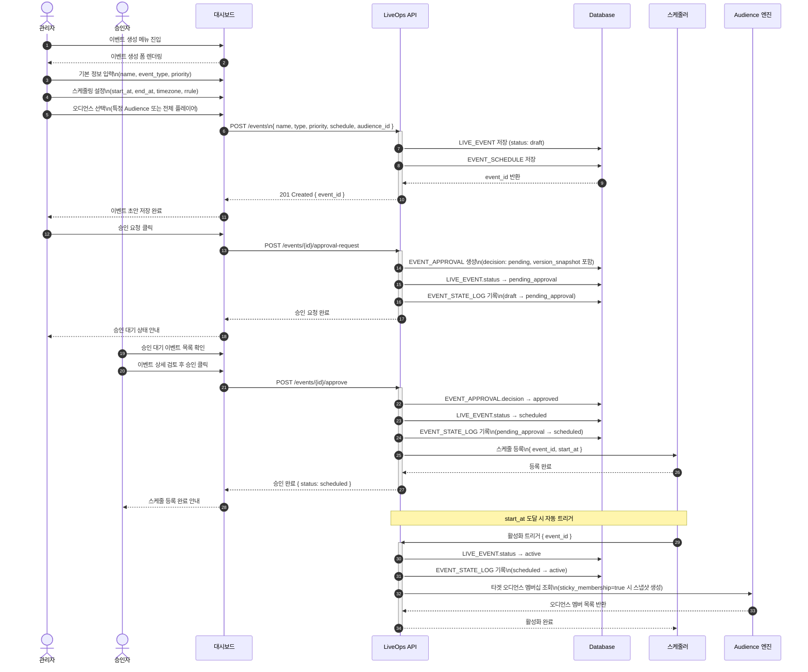
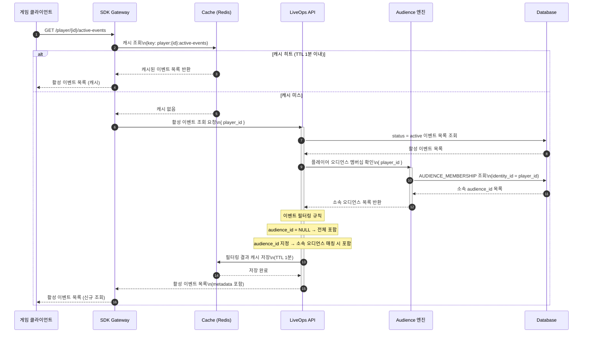
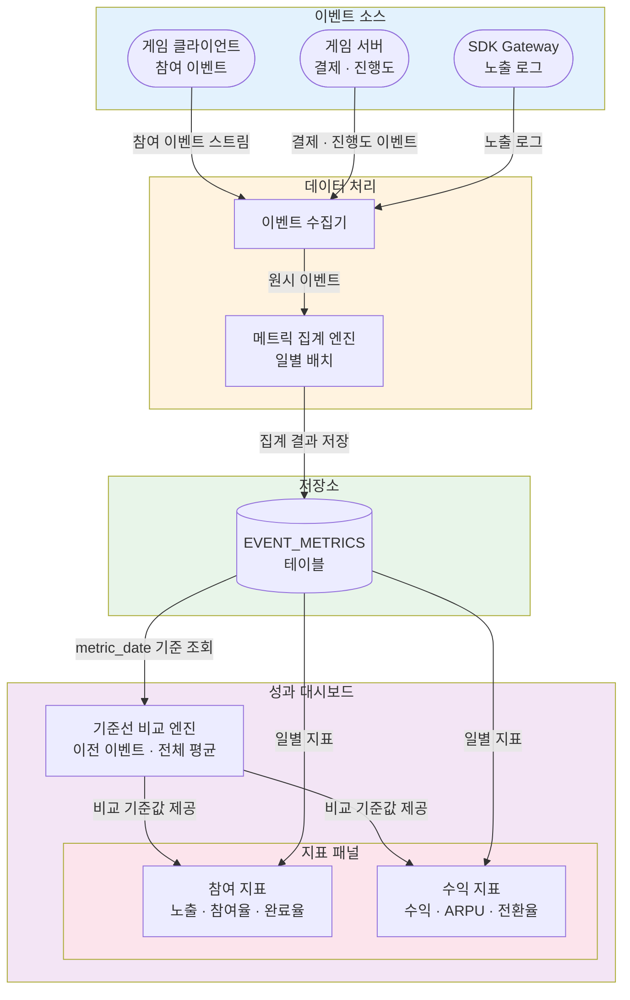

# 다이어그램: 라이브 이벤트 생성 및 스케줄링

> Game LiveOps Service의 라이브 이벤트 생성·승인·스케줄링·런타임 타겟팅·메트릭 수집 전 과정을 시각화한 다이어그램 문서. DIA-GLO-001의 LIVE_EVENT 엔티티를 확장하여 이벤트 수명 주기(Lifecycle) 전반을 다룬다.

## 문서 정보

| 항목 | 내용 |
|------|------|
| 문서 ID | DIA-GLO-002 |
| 버전 | v1.0 |
| 상태 | draft |
| 작성일 | 2026-03-23 |
| 작성자 | diagram |
| 관련 PRD | PRD-GLO-002 |
| 관련 UX | UX-GLO-002 |
| 참조 다이어그램 | DIA-GLO-001 |

---

## DIA-010: ERD (Entity Relationship Diagram)

### 설명

DIA-GLO-001의 LIVE_EVENT 엔티티를 확장하여 라이브 이벤트 시스템 전체 데이터 모델을 나타낸다. LIVE_EVENT를 중심으로 스케줄(EVENT_SCHEDULE), 페이즈(EVENT_PHASE), 승인 이력(EVENT_APPROVAL), 일별 성과 지표(EVENT_METRICS), 상태 변경 로그(EVENT_STATE_LOG)가 연결된다. `audience_id`가 NULL인 경우 전체 플레이어를 대상으로 한다. AUDIENCE 엔티티는 DIA-GLO-001에서 정의된 엔티티를 참조한다.

> **참고**
> - `event_type`: `promotion` / `seasonal` / `competitive` / `special`
> - `priority`: `low` / `medium` / `high` / `critical`
> - `status`: `draft` / `pending_approval` / `scheduled` / `active` / `paused` / `ended` / `archived`
> - `EVENT_SCHEDULE.schedule_type`: `simple` / `recurring` (반복 시 `rrule` 필드에 RFC 5545 형식 저장)
> - `EVENT_PHASE.phase_type`: `main` / `warmup` / `cooldown` / `bonus` (MVP는 `main` 단일 페이즈)
> - `EVENT_APPROVAL.decision`: `pending` / `approved` / `rejected`
> - `AUDIENCE` 엔티티 전체 정의는 DIA-GLO-001 참조

---

## DIA-011: 이벤트 상태 머신 다이어그램

### 설명

라이브 이벤트의 7가지 상태(`draft` → `pending_approval` → `scheduled` → `active` → `paused` → `ended` → `archived`)와 각 전이 조건을 나타낸다. 시스템 자동 전이(스케줄러 기반)와 관리자 수동 전이를 구분하여 표시하며, 긴급 제어 흐름(Pause / Kill)을 별도 note로 강조한다. `draft → draft` 자기 전이는 편집 작업을 의미한다. Extend(종료 시각 연장)는 상태 전이를 수반하지 않으므로 note로만 표시한다.

---

## DIA-012: 이벤트 생성~승인~활성화 시퀀스 다이어그램

### 설명

관리자가 이벤트를 생성하고 승인을 요청한 후, 승인자가 검토하여 스케줄러에 등록되고 `start_at` 도달 시 이벤트가 자동 활성화되는 전체 시퀀스를 나타낸다. 승인 요청 시점에 `version_snapshot`이 함께 저장되어 이후 이벤트 내용 변경 이력을 추적할 수 있다. 활성화 직후 Audience 엔진을 통해 타겟 오디언스 멤버십이 조회(sticky 설정 시 스냅샷 생성)된다.

---

## DIA-013: 이벤트 런타임 타겟팅 시퀀스 다이어그램

### 설명

게임 클라이언트가 SDK Gateway를 통해 활성 이벤트 목록을 요청할 때, Redis 캐시 조회(TTL 1분) → 캐시 미스 시 LiveOps API 호출 → Audience 엔진을 통한 플레이어 오디언스 멤버십 확인 → 이벤트 필터링 → 캐시 저장 순서로 처리되는 흐름을 나타낸다. `audience_id = NULL`인 이벤트는 전체 플레이어에게 반환되며, 오디언스 지정 이벤트는 해당 멤버십 보유 여부로 필터링된다.

---

## DIA-014: 데이터 흐름 다이어그램 (메트릭 수집)

### 설명

게임 클라이언트·서버·SDK Gateway에서 발생하는 원시 데이터가 이벤트 수집기를 거쳐 일별 배치로 집계되고, EVENT_METRICS 테이블에 저장된 후 성과 대시보드에 표시되는 end-to-end 데이터 흐름을 나타낸다. 성과 대시보드는 참여 지표(노출·참여율·완료율)와 수익 지표(수익·ARPU·전환율)를 함께 제공하며, 기준선 비교 엔진을 통해 이전 이벤트 또는 전체 평균과의 비교를 지원한다.

**집계 지표 설명**

| 지표 | 필드 | 설명 |
| --- | --- | --- |
| 노출 | impressions | SDK Gateway 노출 로그 집계 |
| 참여율 | participation_rate | 참여자 수 / 노출 수 |
| 완료율 | completion_rate | 이벤트 완료자 수 / 참여자 수 |
| 수익 | revenue | 이벤트 기간 결제 금액 합계 |
| ARPU | arpu | 수익 / 참여자 수 |
| 전환율 | conversion_rate | 결제 완료자 수 / 참여자 수 |

---

## 변경 이력

| 버전 | 일자 | 변경 내용 | 작성자 |
|------|------|-----------|--------|
| v1.0 | 2026-03-23 | 초안 작성 - 5종 다이어그램 (ERD, 상태 머신, 생성~활성화 시퀀스, 런타임 타겟팅 시퀀스, 메트릭 데이터 흐름) | diagram |
