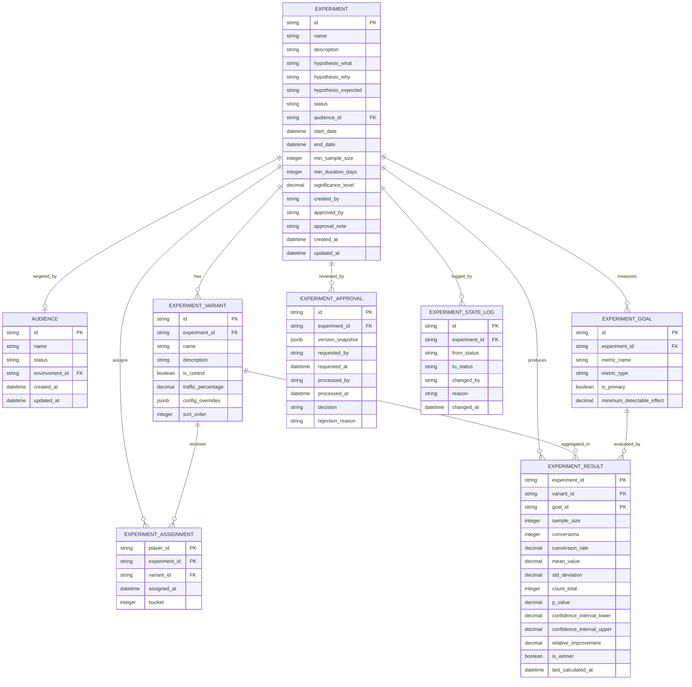
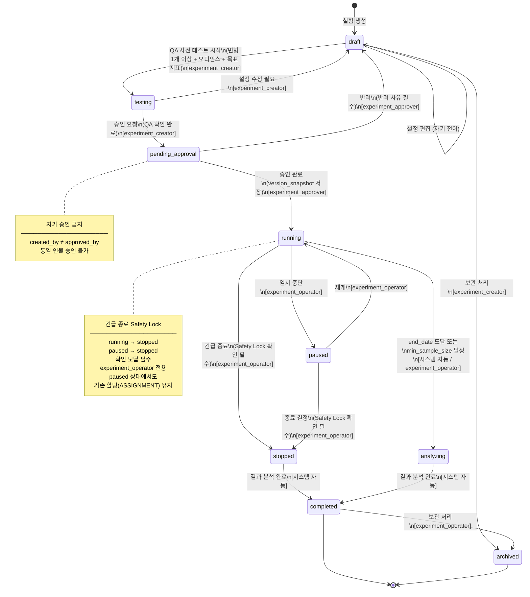
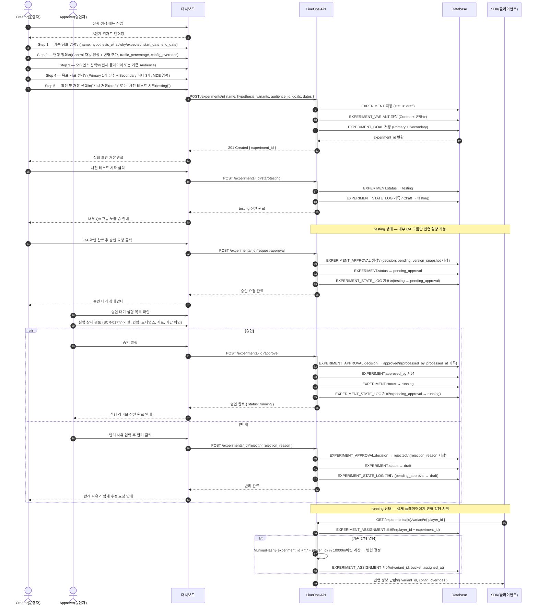
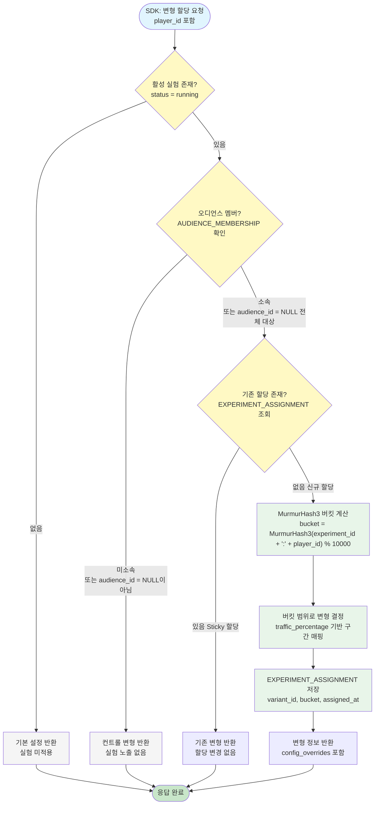

# 다이어그램: A/B 테스트(실험)

> Game LiveOps Service의 A/B 테스트(실험) 기능 전체 구조를 시각화한 다이어그램 문서. 데이터 모델(ERD), 실험 상태 머신, 실험 생성~실행 시퀀스, 트래픽 할당 플로우, 결과 분석 플로우를 포함하며 DIA-GLO-001의 AUDIENCE 엔티티와 DIA-GLO-002의 승인 워크플로우 패턴을 참조한다.

## 문서 정보

| 항목 | 내용 |
|------|------|
| 문서 ID | DIA-GLO-003 |
| 버전 | v1.0 |
| 상태 | draft |
| 작성일 | 2026-03-24 |
| 작성자 | diagram |
| 관련 PRD | PRD-GLO-003 |
| 관련 UX | UX-GLO-003 |
| 참조 다이어그램 | DIA-GLO-001, DIA-GLO-002 |

---

## DIA-015: ERD (Entity Relationship Diagram)

### 설명

A/B 테스트 시스템의 핵심 데이터 모델을 나타낸다. EXPERIMENT를 중심으로 변형(EXPERIMENT_VARIANT), 목표 지표(EXPERIMENT_GOAL), 플레이어 할당(EXPERIMENT_ASSIGNMENT), 집계 결과(EXPERIMENT_RESULT), 승인 이력(EXPERIMENT_APPROVAL), 상태 변경 로그(EXPERIMENT_STATE_LOG)가 연결된다. AUDIENCE 엔티티는 DIA-GLO-001에서 정의된 엔티티를 참조하며, `audience_id`가 NULL인 경우 전체 플레이어를 대상으로 한다.



> **참고**
> - `EXPERIMENT.status`: `draft` / `testing` / `pending_approval` / `running` / `paused` / `stopped` / `analyzing` / `completed` / `archived`
> - `EXPERIMENT_GOAL.metric_type`: `conversion_rate` / `average_value` / `count`
> - `EXPERIMENT_APPROVAL.decision`: `approved` / `rejected`
> - `EXPERIMENT_ASSIGNMENT`의 복합 PK는 `(player_id, experiment_id)`. 플레이어당 실험별 1개 할당만 허용 (Sticky 할당)
> - `EXPERIMENT_RESULT`의 복합 PK는 `(experiment_id, variant_id, goal_id)`. 집계 테이블이므로 개별 이벤트 로그 아님
> - `AUDIENCE` 엔티티 전체 정의는 DIA-GLO-001 참조

---

## DIA-016: 실험 상태 머신 다이어그램

### 설명

실험의 9가지 상태(`draft` → `testing` → `pending_approval` → `running` → `paused` / `stopped` → `analyzing` → `completed` / `archived`)와 각 전이 조건을 나타낸다. 전이 화살표에 트리거 조건과 RBAC 역할을 함께 표시하며, 자가 승인 금지 규칙과 긴급 종료 Safety Lock 확인 흐름을 note로 강조한다. 시스템 자동 전이(`running → analyzing`, `analyzing → completed`)는 `[시스템 자동]` 라벨로 구분한다.



> **RBAC 역할 요약**
> - `experiment_creator`: 실험 생성/편집, `draft ↔ testing`, `testing → pending_approval`
> - `experiment_approver`: `pending_approval → running` (승인), `pending_approval → draft` (반려)
> - `experiment_operator`: `running ↔ paused`, `running/paused → stopped`
> - `system`: `running → analyzing`, `analyzing → completed`, `stopped → completed`

---

## DIA-017: 실험 생성~실행 시퀀스 다이어그램

### 설명

운영자가 5단계 위저드로 실험을 생성하고 `draft`로 저장한 후, `testing` 상태에서 내부 QA를 거쳐 승인을 요청하고, 승인자가 검토하여 `running`으로 전환되고 SDK가 변형을 할당하는 전체 시퀀스를 나타낸다. `pending_approval → running` 전이 시점에 `version_snapshot`이 EXPERIMENT_APPROVAL에 저장되어 승인 후 설정 변조 감지에 활용된다. PRD-GLO-002의 EVENT_APPROVAL 패턴과 동일한 구조다.



---

## DIA-018: 트래픽 할당 플로우차트

### 설명

SDK가 변형 할당을 요청할 때 시스템이 수행하는 결정 흐름을 나타낸다. 활성 실험 존재 여부, 오디언스 멤버십, 기존 할당 존재 여부를 순서대로 확인하여 변형을 결정하며, MurmurHash3 기반의 결정적(deterministic) 해시 할당으로 동일 플레이어는 동일 실험에서 항상 같은 변형을 받는다. 오디언스 미소속 플레이어에게는 컨트롤을, 활성 실험이 없는 경우에는 기본 설정을 반환한다.



> **주요 포인트**
> - **결정적 해시**: `MurmurHash3(experiment_id + ":" + player_id) % 10000` — 동일 플레이어는 동일 실험에서 항상 같은 버킷·변형을 받음
> - **구분자 포함**: `experiment_id + ":" + player_id` 형식으로 연결하여 해시 충돌 방지
> - **Sticky 할당**: EXPERIMENT_ASSIGNMENT가 존재하면 변형을 재계산하지 않고 기존 값을 그대로 반환. `paused` 상태에서도 기존 할당 유지
> - **오디언스 NULL**: `EXPERIMENT.audience_id = NULL`이면 전체 플레이어 대상. 오디언스 지정 실험은 AUDIENCE_MEMBERSHIP 확인 필수
> - **독립 할당 (MVP)**: 동일 오디언스에 복수 실험이 running 중일 수 있으며, 각 실험은 독립적으로 해시 기반 할당

---

## DIA-019: 결과 분석 플로우차트

### 설명

1시간 주기로 실행되는 결과 집계 파이프라인 전체 흐름을 나타낸다. 이벤트 데이터 수집 및 변형별 집계 후 샘플 사이즈 충족 여부를 확인하고, 지표 타입에 따라 통계 검정 방법(Chi-squared 또는 Welch's t-test)을 선택하며, 변형이 2개 이상일 경우 Bonferroni 보정을 적용하여 다중 비교 문제를 처리한다. 최종 결과는 EXPERIMENT_RESULT에 저장되고 대시보드에 반영된다.

```mermaid
flowchart TD
    Start([집계 주기 도달\n1시간 간격]) --> Collect[이벤트 데이터 수집\n목표 지표 이벤트 필터링]

    Collect --> Aggregate[변형별 집계\nsample_size, conversions,\nmean_value, std_deviation, count_total]

    Aggregate --> CheckSample{샘플 사이즈 충족?\nsample_size >= min_sample_size}

    CheckSample -->|미충족| SaveInsufficient[EXPERIMENT_RESULT 저장\nis_winner = false\np_value = null\n수집 진행률 기록]
    SaveInsufficient --> UpdateDashboard

    CheckSample -->|충족| SelectTest{지표 타입?}

    SelectTest -->|conversion_rate\n이항 결과| ChiSquared[Chi-squared 검정\n카이제곱 검정\n전환/비전환 2×N 교차표]
    SelectTest -->|average_value\ncount\n연속형 값| WelchT[Welch's t-test\n웰치의 t-검정\n등분산 가정 없는 t-검정]

    ChiSquared --> CheckMultiple{변형 수 >= 2?\n컨트롤 + 2개 이상 변형}
    WelchT --> CheckMultiple

    CheckMultiple -->|Yes 다중 비교| Bonferroni[Bonferroni 보정 적용\n조정된 α = α ÷ 변형 수 - 1\n예: 3개 변형 → α = 0.05 ÷ 3 ≈ 0.0167]
    CheckMultiple -->|No 단일 비교| CalcPValue[p-value 계산\n각 변형 vs 컨트롤]

    Bonferroni --> CalcPValue

    CalcPValue --> CalcCI[신뢰구간 계산\n(1-α) × 100% CI\nconfidence_interval_lower/upper]

    CalcCI --> CalcImprovement[상대적 개선율 계산\nrelative_improvement =\n변형값 ÷ 컨트롤값 - 1 × 100%]

    CalcImprovement --> DetermineWinner{승자 판별\np < 조정된 α?\n+Primary metric 최고 성과?}

    DetermineWinner -->|Yes 유의미한 차이| MarkWinner[승자 변형 표시\nis_winner = true]
    DetermineWinner -->|No 유의미한 차이 없음| MarkNoWinner[승자 없음\nis_winner = false\n유의미한 차이 없음 표시]

    MarkWinner --> SaveResult[EXPERIMENT_RESULT 저장\np_value, CI, is_winner,\nrelative_improvement, last_calculated_at]
    MarkNoWinner --> SaveResult

    SaveResult --> CheckAnalyzing{실험이 analyzing 상태?}

    CheckAnalyzing -->|Yes| CompleteExp[EXPERIMENT.status → completed\n[시스템 자동]\nEXPERIMENT_STATE_LOG 기록]
    CheckAnalyzing -->|No running 상태 계속| UpdateDashboard[대시보드 갱신\n변형별 지표 + 통계 시각화 업데이트]

    CompleteExp --> UpdateDashboard
    UpdateDashboard --> End([집계 사이클 완료])

    style Start fill:#e1f5fe
    style End fill:#c8e6c9
    style CheckSample fill:#fff9c4
    style SelectTest fill:#fff9c4
    style CheckMultiple fill:#fff9c4
    style DetermineWinner fill:#fff9c4
    style CheckAnalyzing fill:#fff9c4
    style SaveInsufficient fill:#f5f5f5
    style Bonferroni fill:#fce4ec
    style MarkWinner fill:#e8f5e9
    style CompleteExp fill:#e3f2fd
```

> **주요 포인트**
> - **집계 주기**: 1시간마다 실행. `running` 및 `analyzing` 상태 실험 모두 대상
> - **검정 방법 선택**: `conversion_rate` → Chi-squared, `average_value` / `count` → Welch's t-test (등분산 가정 불필요)
> - **Bonferroni 보정**: 컨트롤 + 2개 이상 변형인 경우 적용. 조정된 α = `significance_level` ÷ (변형 수 - 1). Secondary 지표에는 미적용 (탐색적 분석 라벨 표시)
> - **샘플 미충족 처리**: `min_sample_size` 미달 시 `p_value = null`, `is_winner = false`로 저장하고 수집 진행률을 대시보드에 표시
> - **`analyzing → completed` 자동 전이**: `analyzing` 상태에서 집계 완료 시 시스템이 자동으로 `completed`로 전환하고 STATE_LOG 기록

---

## 변경 이력

| 버전 | 일자 | 변경 내용 | 작성자 |
|------|------|-----------|--------|
| v1.0 | 2026-03-24 | 초안 작성 - 5종 다이어그램 (ERD, 상태 머신, 생성~실행 시퀀스, 트래픽 할당 플로우, 결과 분석 플로우) | diagram |
