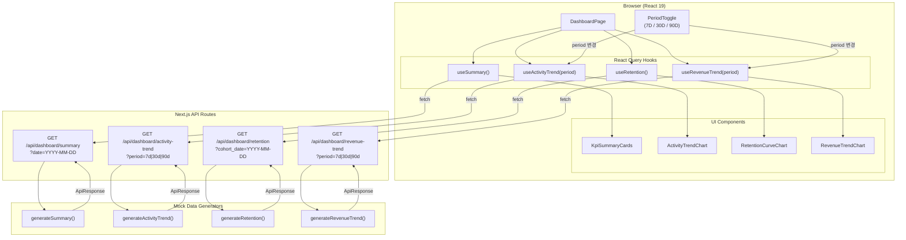
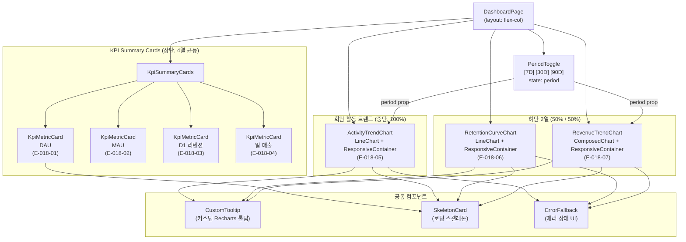

# 다이어그램: 핵심 지표 대시보드

> Game LiveOps Service의 핵심 지표 대시보드(KPI Dashboard)의 데이터 플로우와 컴포넌트 구조를 시각화한 다이어그램 문서. SPEC-GLO-002 디자인 스펙을 기반으로 브라우저에서 Mock API를 통해 KPI 데이터를 조회하고 차트로 렌더링하는 전체 흐름을 다룬다.

## 문서 정보

| 항목 | 내용 |
|------|------|
| 문서 ID | DIA-GLO-004 |
| 버전 | v1.0 |
| 상태 | draft |
| 작성일 | 2026-03-26 |
| 작성자 | diagram |
| 관련 PRD | PRD-GLO-004 |
| 관련 UX | UX-GLO-004 |
| 참조 스펙 | SPEC-GLO-002 |

---

## DIA-020: KPI 대시보드 데이터 플로우

### 설명

브라우저에서 React Query hooks를 통해 Next.js API Routes를 호출하고, Mock Data Generators가 응답을 생성하여 반환하는 전체 데이터 플로우를 나타낸다. 4개 API 엔드포인트(`/api/dashboard/summary`, `/api/dashboard/activity-trend`, `/api/dashboard/retention`, `/api/dashboard/revenue-trend`)가 각각 독립적으로 호출되며, React Query가 캐싱과 리페칭을 관리한다. 기간 토글(7D/30D/90D) 변경 시 `period` 파라미터가 변경되어 `activity-trend`와 `revenue-trend` 엔드포인트를 refetch한다.

> **참고**
> - 모든 API는 공통 응답 래퍼 `ApiResponse<T>` 사용 (`success`, `data`, `meta` 필드)
> - `meta.generatedAt`: ISO 8601 형식 타임스탬프
> - React Query `staleTime`: 1분 (Mock 데이터이므로 긴 캐싱 적용)
> - 기간 토글 변경 시 `queryKey`에 `period` 포함 → 자동 refetch
> - TypeScript 타입 정의는 SPEC-GLO-002 Section 4.3 참조

---

## DIA-021: 대시보드 컴포넌트 구조

### 설명

KPI 대시보드의 React 컴포넌트 계층 구조를 나타낸다. `DashboardPage`가 최상위 컴포넌트로 전체 레이아웃을 관리하며, `KpiSummaryCards`가 4개의 `KpiMetricCard`를 렌더링한다. `PeriodToggle`은 기간 상태를 관리하여 `ActivityTrendChart`와 `RevenueTrendChart`에 `period` prop을 전달한다. 각 차트 컴포넌트는 Recharts의 `ResponsiveContainer`를 사용하여 반응형으로 동작한다.

> **참고**
> - `DashboardPage` 레이아웃: `flex flex-col gap-6`
> - KPI Summary Cards: `grid grid-cols-4 gap-4` (4열 균등 배치)
> - 하단 영역: `grid grid-cols-2 gap-6` (리텐션 좌측, 수익 우측)
> - `PeriodToggle`: 회원 활동 트렌드 차트 섹션 우측 상단에 배치
> - 각 차트 높이 — 회원 활동 트렌드: 300px, 리텐션 커브: 350px, 수익 트렌드: 350px
> - `KpiMetricCard` props: `title`, `value`, `unit`, `changeRate`, `comparisonValue`
> - 차트 색상 체계는 SPEC-GLO-002 Section 3 참조
> - 컴포넌트 위치: `apps/admin/src/components/dashboard/`

---

## 변경 이력

| 버전 | 날짜 | 변경 내용 | 작성자 |
|------|------|----------|--------|
| v1.0 | 2026-03-26 | KPI 대시보드 다이어그램 최초 작성 | diagram |
