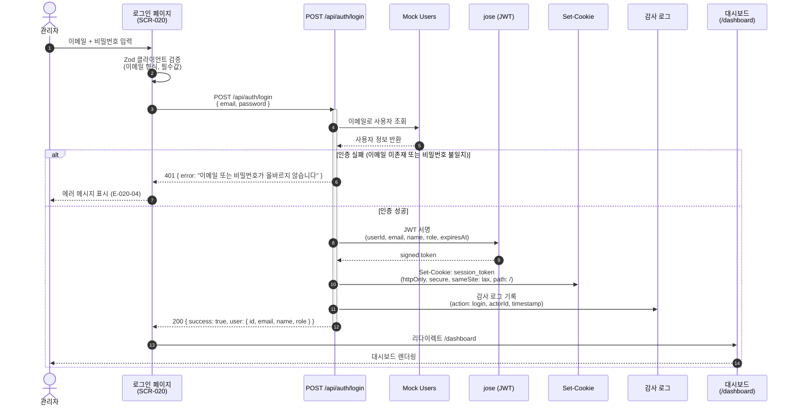
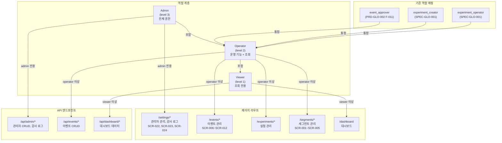

# 다이어그램: 역할 기반 접근 제어 (RBAC)

> Game LiveOps Service의 역할 기반 접근 제어(RBAC) 시스템을 시각화한 다이어그램 문서. 인증 플로우, Middleware 라우트 보호, 역할 계층 및 라우트 매핑을 Mermaid 다이어그램으로 나타낸다.

## 문서 정보

| 항목 | 내용 |
|------|------|
| 문서 ID | DIA-GLO-005 |
| 버전 | v1.0 |
| 상태 | draft |
| 작성일 | 2026-03-26 |
| 작성자 | diagram |
| 관련 스펙 | SPEC-GLO-003 |
| 관련 UX | UX-GLO-005 |

---

## DIA-022: 인증 플로우 (시퀀스 다이어그램)

### 설명

관리자가 로그인 페이지(SCR-020)에서 이메일/비밀번호를 입력하고 인증을 거쳐 대시보드로 진입하는 전체 시퀀스를 나타낸다. Mock 사용자 데이터베이스에서 자격 증명을 검증하고, jose를 사용하여 JWT를 서명한 뒤 httpOnly 쿠키로 설정한다. 인증 성공/실패 분기와 감사 로그 기록 시점을 포함한다.



> **참고**
> - Mock 계정: admin@liveops.dev (admin), operator@liveops.dev (operator), viewer@liveops.dev (viewer)
> - 세션 만료: 24시간 고정
> - 로그아웃 시 `POST /api/auth/logout` → 쿠키 삭제 → `/login` 리다이렉트 → 감사 로그 기록

---

## DIA-023: Middleware 라우트 보호 플로우 (플로우차트)

### 설명

Next.js Middleware에서 매 요청마다 수행하는 라우트 보호 로직을 나타낸다. 공개 경로 판단 → 세션 쿠키 존재 확인 → JWT 복호화 및 만료 검증 → 요청 경로별 최소 역할 확인 → 사용자 역할 수준 비교 순서로 처리한다. 각 단계에서의 분기 처리(리다이렉트, 401, 403)를 명시한다.

```mermaid
flowchart TD
    A[요청 수신] --> B{공개 경로인가?<br/>/login, /api/auth/*}

    B -->|예| C[통과 — 요청 처리]
    B -->|아니오| D{session_token<br/>쿠키 존재?}

    D -->|없음| E{페이지 요청?}
    E -->|예| F[/login 리다이렉트]
    E -->|아니오 — API| G[401 JSON 반환]

    D -->|있음| H[JWT 복호화<br/>jose.jwtVerify]

    H --> I{JWT 유효?<br/>만료 확인}

    I -->|만료/무효| J[쿠키 삭제]
    J --> E

    I -->|유효| K[사용자 정보 추출<br/>userId, role]

    K --> L{요청 경로의<br/>최소 역할 확인}

    L --> M{"/settings/*"<br/>→ admin}
    L --> N{"/events/*"<br/>"/experiments/*"<br/>"/segments/*"<br/>→ operator}
    L --> O{"/dashboard"<br/>→ viewer}

    M --> P{roleLevel >= 3?}
    N --> Q{roleLevel >= 2?}
    O --> R{roleLevel >= 1?}

    P -->|예| S[통과 — 헤더 주입<br/>x-user-id, x-user-role]
    P -->|아니오| T{페이지 요청?}
    Q -->|예| S
    Q -->|아니오| T
    R -->|예| S
    R -->|아니오| T

    T -->|예| U[403 페이지<br/>SCR-025]
    T -->|아니오 — API| V[403 JSON 반환]

    S --> C
```

> **참고**
> - 공개 경로: `/login`, `/api/auth/*`
> - 역할 수준: admin(3), operator(2), viewer(1)
> - 통과 시 요청 헤더에 `x-user-id`, `x-user-role` 주입하여 하위 API 라우트에서 활용
> - SPEC-GLO-003 Section 4.1 라우트 규칙 참조

---

## DIA-024: 역할 계층 + 라우트 매핑 (그래프)

### 설명

Admin/Operator/Viewer 3역할의 계층 구조와 각 역할이 접근 가능한 라우트를 매핑한 다이어그램. 상위 역할은 하위 역할의 모든 접근 권한을 자동 포함하며, 역할별로 접근 가능한 페이지 라우트와 API 엔드포인트를 시각화한다.



> **참고**
> - 역할 검사는 `ROLE_LEVELS[user.role] >= ROLE_LEVELS[requiredRole]` 비교로 수행
> - Admin은 Operator + Viewer의 모든 접근 권한을 자동 포함
> - `event_approver`(PRD-GLO-002), `experiment_creator/operator`(SPEC-GLO-001)는 Operator 역할에 통합
> - 공개 경로(`/login`, `/api/auth/*`)는 역할 검사 없이 접근 가능
> - SPEC-GLO-003 Section 2.3 기존 시스템 연동 참조

---

## 변경 이력

| 버전 | 날짜 | 변경 내용 | 작성자 |
|------|------|----------|--------|
| v1.0 | 2026-03-26 | RBAC 다이어그램 최초 작성 | diagram |
