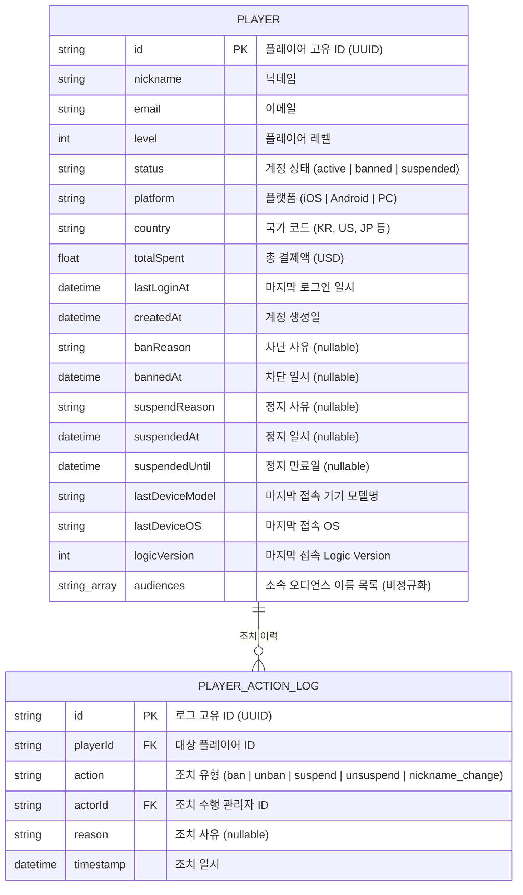
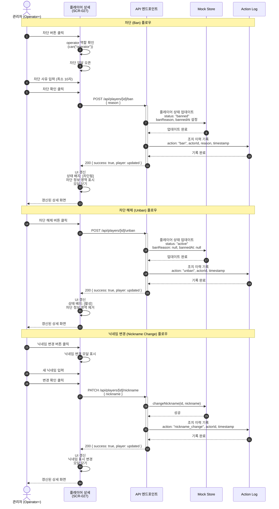
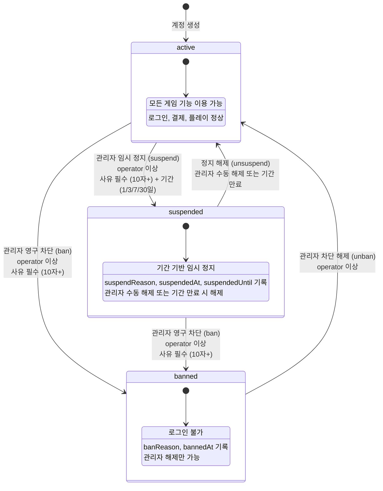

# 다이어그램: 플레이어 상태 조회 및 계정 조치

> Game LiveOps Service의 플레이어 상태 조회 및 계정 조치 시스템을 시각화한 다이어그램 문서. 플레이어 데이터 모델, 계정 조치 시퀀스, 상태 전이를 Mermaid 다이어그램으로 나타낸다.

## 문서 정보

| 항목 | 내용 |
|------|------|
| 문서 ID | DIA-GLO-006 |
| 버전 | v1.0 |
| 상태 | draft |
| 작성일 | 2026-03-27 |
| 작성자 | diagram |
| 관련 PRD | PRD-GLO-006 |
| 관련 UX | UX-GLO-006 |

---

## DIA-028: 플레이어 검색 플로우 (플로우차트)

### 설명

플레이어 목록 페이지(SCR-026)에서 검색어 입력부터 상세 페이지 이동까지의 검색 플로우를 나타낸다. F-034 플레이어 검색 기능의 전체 흐름을 시각화한다.

```mermaid
flowchart TD
    A[검색어 입력] --> B{300ms 디바운스}
    B --> C[API 호출: GET /api/players?q=]
    C --> D{결과 존재?}
    D -->|Yes| E[결과 테이블 표시]
    D -->|No| F[검색 결과 없음 표시]
    E --> G{11건 이상?}
    G -->|Yes| H[페이지네이션 표시]
    G -->|No| I[단일 페이지]
    H --> J[행 클릭]
    I --> J
    J --> K[/players/id 상세 이동]
```

> **참고**
> - 검색 입력 시 300ms 디바운스 적용 (REQ-034-02)
> - 검색어가 비어 있으면 전체 플레이어 목록 표시 (REQ-034-06)
> - 페이지당 10건 표시, 11건 이상 시 페이지네이션 컨트롤 표시 (REQ-034-05)
> - 행 클릭 시 `/players/[id]` 상세 페이지로 이동 (REQ-034-07)

---

## DIA-025: 플레이어 데이터 모델 (ERD)

### 설명

플레이어 관리 기능의 핵심 데이터 모델을 나타낸다. PLAYER 엔티티는 계정 정보, 게임 데이터, 상태 정보를 포함하며, 소속 오디언스는 비정규화된 문자열 배열로 저장한다. PLAYER_ACTION_LOG는 관리자가 수행한 계정 조치(차단, 해제, 닉네임 변경)의 이력을 기록한다.



> **참고**
> - Player 타입 정의: `apps/admin/src/features/players/types/player.ts`
> - status 필드는 `PlayerStatus` 타입으로 "active", "banned", "suspended" 3개 값을 가짐
> - platform 필드는 `Platform` 타입으로 "iOS", "Android", "PC" 3개 값을 가짐
> - banReason, bannedAt은 banned 상태일 때만 값이 존재
> - suspendReason, suspendedAt, suspendedUntil은 suspended 상태일 때만 값이 존재
> - audiences는 오디언스 이름을 비정규화된 `string[]` 배열로 저장 (현재 Mock 구현 및 PRD-GLO-006 데이터 모델 기준). 프로덕션에서는 AUDIENCE 엔티티와 M:N 정규화 모델로 전환 예정 (세그먼테이션 ERD DIA-GLO-001 참조)

---

## DIA-026: 계정 조치 플로우 (시퀀스 다이어그램)

### 설명

관리자가 플레이어 상세 페이지(SCR-027)에서 차단(ban), 차단 해제(unban), 닉네임 변경(nickname change) 조치를 수행하는 시퀀스를 나타낸다. Operator 이상 역할 확인, 사유 입력, API 호출, Mock Store 업데이트, UI 갱신, 조치 이력 기록 순서로 처리한다.



> **참고**
> - 차단 사유는 최소 10자 이상 입력 필수 (클라이언트 검증)
> - 차단/해제 버튼은 operator 이상 역할에게만 표시 (`can("operator")`)
> - 차단 버튼은 active 상태일 때만, 해제 버튼은 banned 상태일 때만 표시
> - mutation 처리 중 버튼 disabled + "처리 중..." 텍스트 표시
> - React Query의 useBanPlayer, useUnbanPlayer 훅 사용

---

## DIA-027: 플레이어 상태 전이 (상태 다이어그램)

### 설명

플레이어 계정의 3가지 상태(active, banned, suspended) 간 전이를 나타낸다. 관리자에 의한 차단/해제와 시스템에 의한 정지/복구 경로를 구분하여 표시한다.



> **참고**
> - 상태값은 `PlayerStatus` 타입: "active" | "banned" | "suspended"
> - active(활성): 초록 배지, banned(차단됨): 빨강 배지, suspended(정지됨): 주황 배지
> - banned 상태에서는 banReason(차단 사유)과 bannedAt(차단 일시)이 기록됨
> - suspended 상태에서는 suspendReason(정지 사유), suspendedAt(정지 일시), suspendedUntil(만료일)이 기록됨
> - suspended → banned 전환 시 정지 관련 필드는 초기화되고 차단 관련 필드가 설정됨
> - 상태 배지 설정: `PLAYER_STATUS_CONFIG` (`apps/admin/src/features/players/types/player.ts`)

---

## 변경 이력

| 버전 | 날짜 | 변경 내용 | 작성자 |
|------|------|----------|--------|
| v1.0 | 2026-03-27 | 플레이어 관리 다이어그램 최초 작성 | diagram |
| v1.1 | 2026-03-27 | REV-GLO-004 리뷰 반영: 검색 플로우차트 추가, ERD 비정규화 반영, 닉네임 변경 시퀀스 추가, 상태 전이 레이블 명확화 | diagram |
| v1.2 | 2026-03-27 | ERD에 기기/버전 필드 추가 | diagram |
| v1.3 | 2026-03-27 | 기간 기반 임시 정지 기능 반영: 상태 다이어그램에 active→suspended, suspended→banned 전이 추가, ERD에 suspendReason/suspendedAt/suspendedUntil 필드 추가 | diagram |
