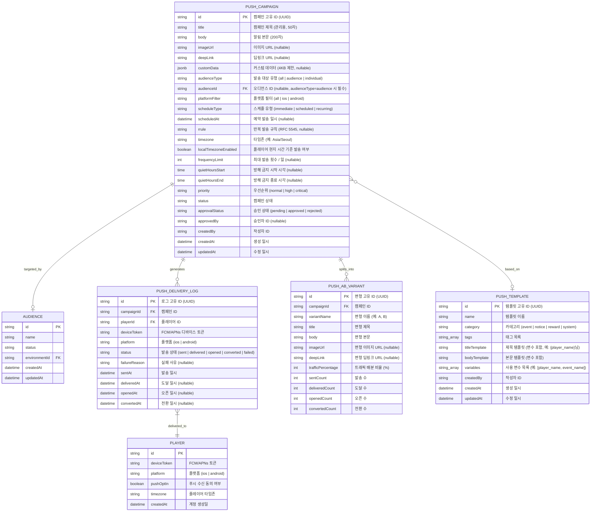
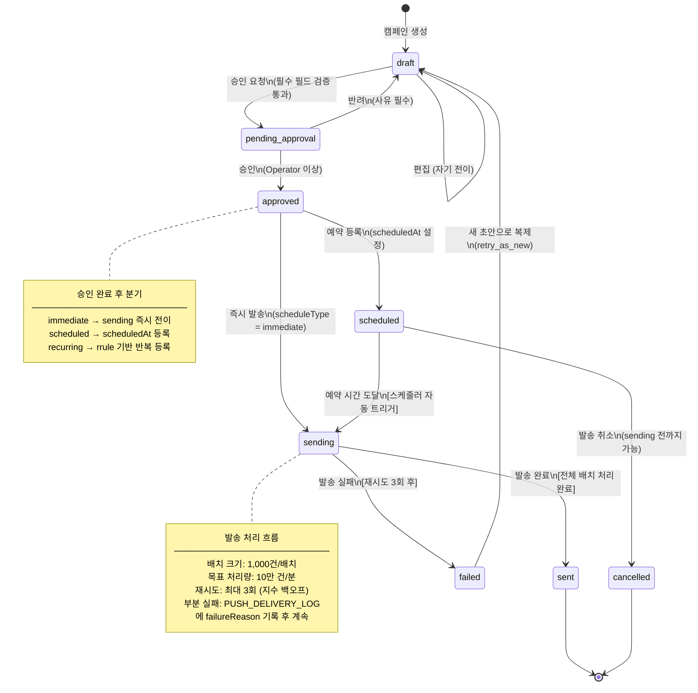
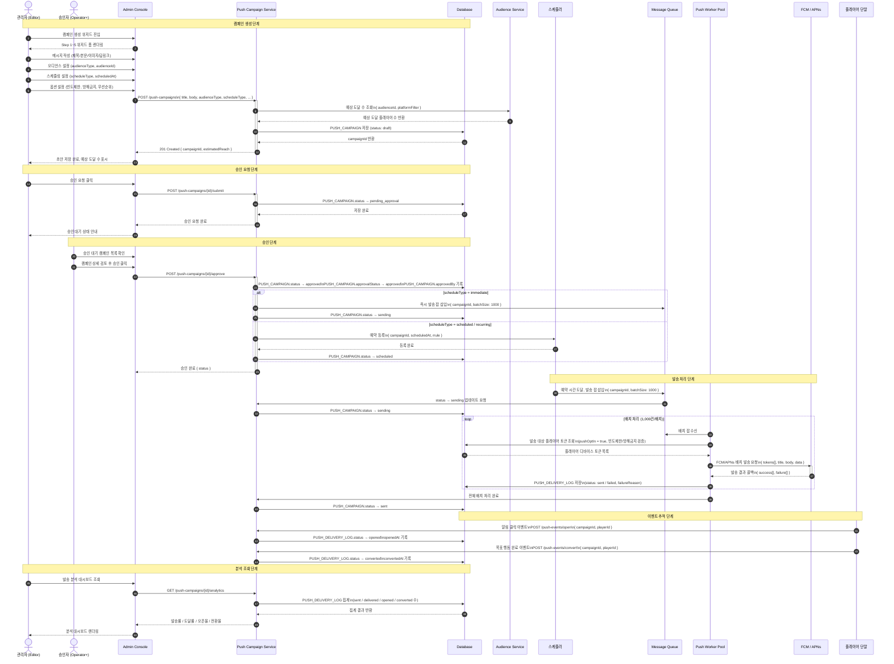
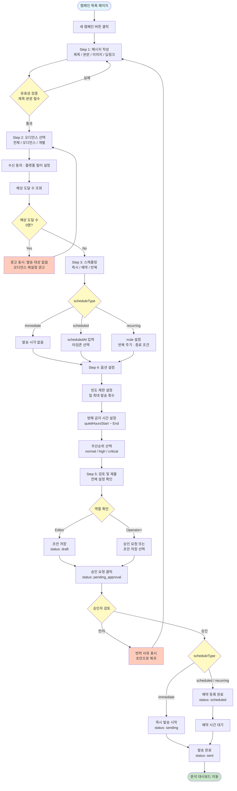
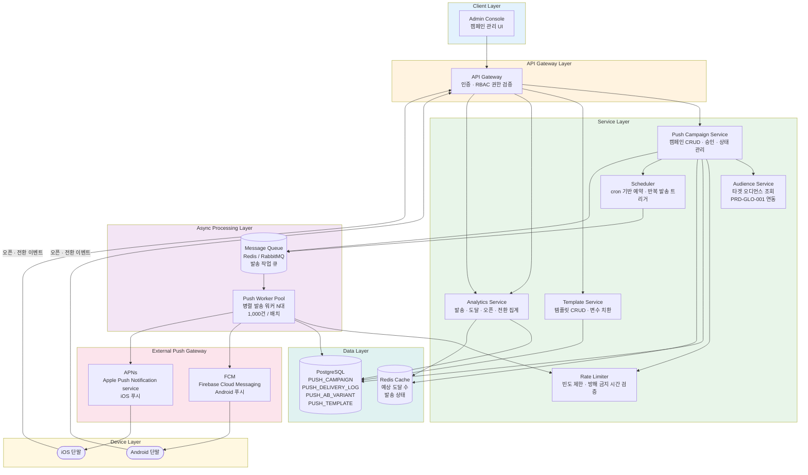

# 다이어그램: 모바일 푸시 알림 발송

> Game LiveOps Service의 모바일 푸시 알림 발송 캠페인 관리 시스템을 시각화한 다이어그램 문서. 캠페인 데이터 모델(ERD), 캠페인 라이프사이클 상태 전이, 발송 시퀀스, 캠페인 생성 유저 플로우, 시스템 아키텍처를 Mermaid 다이어그램으로 나타낸다. PRD-GLO-007의 F-037~F-043 기능을 근거로 한다.

## 문서 정보

| 항목 | 내용 |
|------|------|
| 문서 ID | DIA-GLO-007 |
| 버전 | v1.0 |
| 상태 | draft |
| 작성일 | 2026-03-27 |
| 작성자 | diagram |
| 관련 PRD | PRD-GLO-007 |
| 참조 다이어그램 | DIA-GLO-002 |

---

## DIA-029: 푸시 알림 데이터 모델 (ERD)

### 설명

푸시 알림 발송 시스템의 핵심 데이터 모델을 나타낸다. PUSH_CAMPAIGN이 중심 엔티티이며, 오디언스 타겟팅(AUDIENCE), 발송 로그(PUSH_DELIVERY_LOG), A/B 테스트 변형(PUSH_AB_VARIANT), 메시지 템플릿(PUSH_TEMPLATE)이 연결된다. AUDIENCE 엔티티의 전체 정의는 DIA-GLO-001을 참조한다. `audienceId`가 NULL이고 `audienceType = all`인 경우 전체 플레이어를 대상으로 한다.

> **참고**
> - `PUSH_CAMPAIGN.status`: `draft` / `pending_approval` / `approved` / `scheduled` / `sending` / `sent` / `failed` / `cancelled`
> - `PUSH_CAMPAIGN.audienceType`: `all`(전체) / `audience`(오디언스 지정, AUDIENCE FK 필수) / `individual`(개별 플레이어 직접 지정)
> - `PUSH_CAMPAIGN.priority`: `normal`(일반) / `high`(높음) / `critical`(긴급, FCM high priority 설정)
> - `PUSH_DELIVERY_LOG.status`: `sent`(발송 완료) → `delivered`(단말 도달) → `opened`(알림 클릭) → `converted`(목표 행동 완료) / `failed`(발송 실패)
> - `PUSH_AB_VARIANT.trafficPercentage` 합계는 반드시 100이어야 한다
> - AUDIENCE, PLAYER 엔티티의 전체 정의는 DIA-GLO-001 참조

---

## DIA-030: 캠페인 라이프사이클 상태 다이어그램

### 설명

푸시 캠페인의 8가지 상태와 각 전이 조건을 나타낸다. Editor 역할은 `draft` 작성 및 승인 요청만 가능하며, Operator 이상 역할이 승인·반려를 처리한다. 발송 실패 시 재시도 3회 후 `failed` 상태로 전이되며, `failed` 캠페인은 새 초안으로 복제하여 재시도할 수 있다.

> **참고**
> - `draft → pending_approval`: 제목, 본문, audienceType, scheduleType 필수 필드 검증 통과 시 전이 가능
> - `pending_approval → approved`: Operator 이상 역할 필수 (Editor 본인 승인 불가)
> - `scheduled → cancelled`: `sending` 진입 전(발송 시작 전)까지만 취소 가능
> - `failed → draft`: 기존 캠페인 데이터를 복제하여 새 초안 생성, 원본은 `failed` 상태 유지
> - `recurring` 스케줄 유형은 `sent` 전이 없이 rrule에 따라 `scheduled → sending → scheduled` 사이클 반복

---

## DIA-031: 푸시 발송 시퀀스 다이어그램

### 설명

관리자가 캠페인을 생성·승인 요청하고, 승인자가 승인한 후, 스케줄러가 Message Queue에 배치를 삽입하고, Push Worker Pool이 FCM/APNs를 통해 단말로 발송하며, 플레이어 오픈·전환 이벤트가 수집되어 분석 대시보드에 집계되는 end-to-end 발송 흐름을 나타낸다.

> **참고**
> - Push Worker Pool은 N대로 수평 확장, 목표 처리량 10만 건/분 (PRD-GLO-007 NFR)
> - 빈도 제한(frequencyLimit) 및 방해 금지 시간(quietHoursStart~End)은 Worker가 토큰 조회 시 필터링
> - FCM 실패(invalid token, unregistered 등)는 PUSH_DELIVERY_LOG에 failureReason 기록 후 다음 배치 계속 진행
> - `localTimezoneEnabled = true`인 경우 플레이어 타임존 기준으로 발송 시각을 조정하여 배치 분산 처리

---

## DIA-032: 캠페인 생성 유저 플로우 (플로우차트)

### 설명

관리자가 캠페인 목록 페이지에서 "새 캠페인"을 클릭하여 5단계 위저드를 통해 캠페인을 작성하고 발송까지 완료하는 전체 유저 플로우를 나타낸다. 각 단계의 유효성 검증 분기와 역할별 처리 경로(Editor/Operator+)를 포함한다.

> **참고**
> - 위저드 각 Step은 이전 단계로 자유롭게 이동 가능 (Back 버튼)
> - Step 2 오디언스 선택 시 예상 도달 수를 실시간으로 표시 (F-038)
> - 예상 도달 수 0명 경고는 비차단(non-blocking) 경고로, 강제 진행은 가능하나 권고하지 않음
> - Editor 역할은 승인 요청만 가능하며, 직접 승인 불가 (F-037 수용 기준)
> - Operator 이상은 위저드 완료 즉시 승인 요청 또는 초안 저장 중 선택 가능

---

## DIA-033: 푸시 알림 시스템 아키텍처

### 설명

모바일 푸시 알림 발송 시스템의 전체 컴포넌트 구성과 데이터 흐름을 나타낸다. Admin Console에서 시작하는 캠페인 관리 흐름, Message Queue를 통한 비동기 발송 처리, FCM/APNs를 통한 단말 발송, Analytics Service를 통한 지표 집계로 구성된다. Rate Limiter와 Audience Service는 모든 발송 경로에 관여하는 횡단 관심사(cross-cutting concern)로 표시한다.

**컴포넌트 역할 요약**

| 컴포넌트 | 역할 | 비고 |
|----------|------|------|
| Admin Console | 캠페인 생성·관리 웹 UI | Next.js 기반 관리자 대시보드 |
| API Gateway | 인증/인가, RBAC 역할 검증 | JWT 기반, Editor/Operator/Admin 역할 구분 |
| Push Campaign Service | 캠페인 CRUD, 상태 전이, 승인 처리 | DIA-030 상태 머신 구현 |
| Audience Service | 타겟 오디언스 플레이어 목록 조회 | PRD-GLO-001 세그멘테이션 인프라 재사용 |
| Template Service | 메시지 템플릿 관리, 변수 치환 처리 | F-040 |
| Scheduler | cron 기반 예약·반복 발송 트리거 | rrule(RFC 5545) 파싱 |
| Rate Limiter | 빈도 제한(일 최대 N회), 방해 금지 시간 검증 | F-042, Redis 기반 카운터 |
| Message Queue | 발송 작업 비동기 큐잉 | Redis / RabbitMQ |
| Push Worker Pool | FCM/APNs API 호출, 배치 병렬 처리 | 수평 확장, 목표 10만 건/분 |
| FCM | Android 푸시 발송 게이트웨이 | Firebase Cloud Messaging |
| APNs | iOS 푸시 발송 게이트웨이 | Apple Push Notification service |
| Analytics Service | 발송/도달/오픈/전환 이벤트 집계 | F-041 |
| PostgreSQL | 캠페인·발송 로그·A/B 변형·템플릿 영속 저장 | - |
| Redis Cache | 예상 도달 수, 발송 상태 캐싱 | TTL 기반 |

---

## 변경 이력

| 버전 | 날짜 | 변경 내용 | 작성자 |
|------|------|-----------|--------|
| v1.0 | 2026-03-27 | 초안 작성 - 5종 다이어그램 (ERD, 캠페인 라이프사이클 상태 머신, 발송 시퀀스, 캠페인 생성 유저 플로우, 시스템 아키텍처) | diagram |
