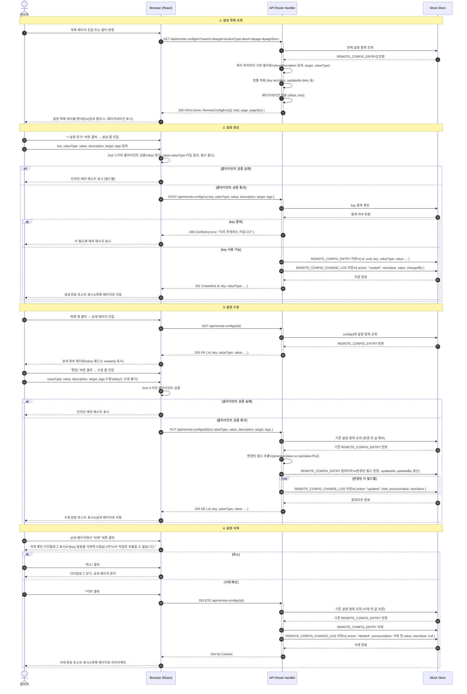
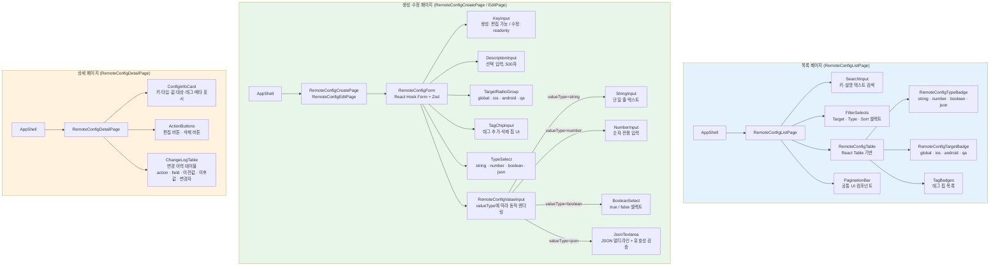

# 다이어그램: Key-Value 원격 설정 (Remote Config)

> Game LiveOps Service의 Key-Value 원격 설정(Remote Config) 관리 시스템을 시각화한 다이어그램 문서. 설정 항목 데이터 모델(ERD), 설정 CRUD 시퀀스, 관리자 유저 플로우, React 컴포넌트 구조, API 라우팅 흐름을 Mermaid 다이어그램으로 나타낸다. PRD-GLO-008의 기능 요구사항을 근거로 한다.

## 문서 정보

| 항목 | 내용 |
|------|------|
| 문서 ID | DIA-GLO-008 |
| 버전 | v1.0 |
| 상태 | draft |
| 작성일 | 2026-03-30 |
| 작성자 | diagram |
| 관련 PRD | PRD-GLO-008 |
| 참조 다이어그램 | DIA-GLO-003 |

---

## DIA-032: Remote Config 데이터 모델 (ERD)

### 설명

Remote Config 시스템의 핵심 데이터 모델을 나타낸다. `REMOTE_CONFIG_ENTRY`가 설정 항목의 중심 엔티티이며, 모든 생성·수정·삭제 이력은 `REMOTE_CONFIG_CHANGE_LOG`에 누적 기록된다. `key`는 전체 시스템에서 고유한 식별자(UK)로, 생성 후 변경 불가 원칙을 데이터 모델 수준에서 보장한다. `tags`는 JSONB 타입으로 저장하여 다중 태그 필터링을 지원한다.

```mermaid
erDiagram
    REMOTE_CONFIG_ENTRY ||--o{ REMOTE_CONFIG_CHANGE_LOG : generates

    REMOTE_CONFIG_ENTRY {
        string id PK "설정 항목 고유 ID (UUID)"
        string key UK "설정 키 (영문·숫자·dot·underscore, 128자, 생성 후 변경 불가)"
        string valueType "값 타입 (string | number | boolean | json)"
        text value "설정 값 (모든 타입을 문자열로 직렬화하여 저장)"
        string description "설명 (500자, nullable)"
        string target "적용 대상 (global | ios | android | qa)"
        jsonb tags "태그 목록 (예: [\"event\", \"season\"])"
        string createdBy "생성자 관리자 ID"
        datetime createdAt "생성 일시"
        string updatedBy "최종 수정자 관리자 ID"
        datetime updatedAt "최종 수정 일시"
    }

    REMOTE_CONFIG_CHANGE_LOG {
        string id PK "변경 로그 고유 ID (UUID)"
        string configId FK "설정 항목 ID (REMOTE_CONFIG_ENTRY.id)"
        string action "변경 액션 (created | updated | deleted)"
        string field "변경된 필드명 (action=updated 시 필수, nullable)"
        text previousValue "변경 전 값 (action=created 시 null)"
        text newValue "변경 후 값 (action=deleted 시 null)"
        string changedBy "변경자 관리자 ID"
        datetime changedAt "변경 일시"
    }
```

> **참고**
> - `REMOTE_CONFIG_ENTRY.key`: 한 번 생성된 키는 수정 불가. 변경이 필요한 경우 삭제 후 신규 생성
> - `REMOTE_CONFIG_ENTRY.valueType`: `string`(문자열) / `number`(정수·소수) / `boolean`(true/false) / `json`(JSON 객체·배열)
> - `REMOTE_CONFIG_ENTRY.value`: 모든 타입을 TEXT로 직렬화 저장. 조회 시 `valueType`에 따라 역직렬화하여 반환
> - `REMOTE_CONFIG_ENTRY.target`: `global`(전체 플랫폼) / `ios`(iOS 전용) / `android`(Android 전용) / `qa`(QA 환경 전용)
> - `REMOTE_CONFIG_CHANGE_LOG.action=updated`: 수정된 필드별로 로그 행이 각각 생성됨 (멀티 필드 수정 시 N개 행)
> - `REMOTE_CONFIG_CHANGE_LOG.action=deleted`: `newValue=null`, 삭제 시점의 전체 value를 `previousValue`에 기록

---

## DIA-033: 설정 CRUD 시퀀스 다이어그램

### 설명

관리자가 Remote Config 설정 항목을 조회·생성·수정·삭제하는 4가지 핵심 시퀀스를 나타낸다. 모든 쓰기 작업(생성·수정·삭제)은 `REMOTE_CONFIG_CHANGE_LOG`에 변경 이력을 자동 기록한다. 현재 구현 단계에서 API Route Handler는 Next.js API Route를 사용하며, 영속 저장소는 Mock Store(인메모리)로 대체한다.



> **참고**
> - 모든 쓰기 작업(생성·수정·삭제)은 항상 `REMOTE_CONFIG_CHANGE_LOG`에 이력을 기록한다
> - 수정 시 변경되지 않은 필드는 ChangeLog를 생성하지 않는다 (변경된 필드만 기록)
> - `key` 필드는 생성 시에만 설정 가능하며, PUT 요청에서 key 변경 시도는 400 Bad Request 반환
> - Mock Store는 인메모리 Map 구조로 구현되며, 서버 재시작 시 초기화됨 (개발 단계)
> - Zod 검증은 클라이언트(인라인 에러)와 서버(API Route) 양쪽에서 동일 스키마를 재사용한다

---

## DIA-034: 관리자 유저 플로우 (Flowchart)

### 설명

관리자가 Remote Config 목록 페이지에 진입하여 설정 항목을 탐색하고 생성·편집·삭제하는 전체 유저 플로우를 나타낸다. 검색·필터링 경로, 신규 생성 경로, 행 클릭을 통한 상세/편집/삭제 경로를 포함하며, 각 분기에서의 유효성 검증 및 오류 처리 흐름을 표시한다.

```mermaid
flowchart TD
    Start([목록 페이지 진입]) --> A[설정 목록 테이블 렌더링\n전체 항목 표시]

    A --> B{사용자 액션}

    B -->|검색어 입력| C[key / description 텍스트 검색]
    B -->|필터 변경| D[Target · Type 필터 선택\n정렬 기준 변경]
    B -->|페이지 이동| E[페이지네이션 바 클릭]
    B -->|+ 설정 추가| F[생성 폼 페이지 이동]
    B -->|행 클릭| K[상세 페이지 이동]

    C --> A
    D --> A
    E --> A

    %% 생성 플로우
    F --> G[key, valueType, value 입력\ndescription, target, tags 선택]
    G --> H{클라이언트 유효성 검증\nZod 스키마}
    H -->|실패| I[필드별 인라인 에러 표시]
    I --> G
    H -->|통과| J[POST /api/remote-configs]
    J --> J1{서버 응답}
    J1 -->|409 key 중복| J2[key 필드 에러 표시\n다른 키 입력 유도]
    J2 --> G
    J1 -->|201 생성 완료| J3[생성 완료 토스트]
    J3 --> A

    %% 상세 플로우
    K --> L[설정 항목 상세 정보 표시\nChangeLog 테이블 포함]
    L --> M{사용자 액션}

    M -->|편집 클릭| N[수정 폼 진입\nkey 필드 readonly]
    M -->|삭제 클릭| R[삭제 확인 다이얼로그 표시]
    M -->|목록으로| A

    %% 편집 플로우
    N --> O[valueType, value, description\ntarget, tags 수정]
    O --> P{클라이언트 유효성 검증\nZod 스키마}
    P -->|실패| Q[필드별 인라인 에러 표시]
    Q --> O
    P -->|통과| P1[PUT /api/remote-configs/{id}]
    P1 --> P2{서버 응답}
    P2 -->|400 오류| P3[에러 메시지 표시]
    P3 --> O
    P2 -->|200 수정 완료| P4[수정 완료 토스트]
    P4 --> L

    %% 삭제 플로우
    R --> S{관리자 선택}
    S -->|취소| L
    S -->|삭제 확인| T[DELETE /api/remote-configs/{id}]
    T --> U{서버 응답}
    U -->|오류| V[에러 토스트 표시]
    V --> L
    U -->|204 삭제 완료| W[삭제 완료 토스트]
    W --> A

    style Start fill:#e1f5fe
    style A fill:#e1f5fe
    style H fill:#fff9c4
    style J1 fill:#fff9c4
    style M fill:#fff9c4
    style P fill:#fff9c4
    style P2 fill:#fff9c4
    style S fill:#fff9c4
    style U fill:#fff9c4
    style B fill:#fff9c4
    style I fill:#ffccbc
    style J2 fill:#ffccbc
    style Q fill:#ffccbc
    style P3 fill:#ffccbc
    style V fill:#ffccbc
    style J3 fill:#c8e6c9
    style P4 fill:#c8e6c9
    style W fill:#c8e6c9
```

> **참고**
> - 검색·필터·정렬·페이지네이션은 모두 URL 쿼리 파라미터로 관리하여 새로고침 시 상태 유지
> - `valueType` 선택에 따라 value 입력 컴포넌트가 동적으로 변경됨 (StringInput / NumberInput / BooleanSelect / JsonTextarea)
> - 생성 폼에서 key 중복 에러(409)는 서버 응답 후 key 필드 포커스를 자동으로 이동
> - 삭제 확인 다이얼로그에는 삭제 대상 key를 명시하여 실수 방지
> - 편집 완료 후 상세 페이지로 돌아가 변경된 값과 ChangeLog 최신 행을 확인할 수 있음

---

## DIA-035: React 컴포넌트 구조 다이어그램

### 설명

Remote Config 기능을 구성하는 React 컴포넌트 트리를 나타낸다. 목록 페이지, 생성/수정 폼 페이지, 상세 페이지의 3가지 주요 페이지와 각 페이지를 구성하는 하위 컴포넌트의 계층 관계를 보여준다. `RemoteConfigValueInput`은 `valueType`에 따라 4가지 입력 컴포넌트 중 하나를 조건부 렌더링하는 복합 컴포넌트다.



**컴포넌트 역할 요약**

| 컴포넌트 | 역할 | 비고 |
|----------|------|------|
| RemoteConfigListPage | 목록 조회, 검색·필터·정렬·페이지네이션 | URL 쿼리 파라미터 상태 관리 |
| SearchInput | key·description 텍스트 검색 입력 | 디바운스 300ms 적용 |
| FilterSelects | Target, valueType, 정렬 기준 셀렉트 | Shadcn Select 컴포넌트 |
| RemoteConfigTable | 설정 목록 테이블 | React Table, 행 클릭 시 상세 이동 |
| RemoteConfigTypeBadge | valueType 시각적 구분 배지 | string(파랑) / number(초록) / boolean(보라) / json(주황) |
| RemoteConfigTargetBadge | target 시각적 구분 배지 | global(회색) / ios(하늘) / android(녹색) / qa(노랑) |
| TagBadges | 태그 목록 칩 표시 | 태그별 클릭 시 해당 태그 필터 적용 |
| PaginationBar | 페이지네이션 UI | 공통 UI 컴포넌트 재사용 |
| RemoteConfigForm | 생성·수정 공용 폼 | React Hook Form + Zod, mode="onChange" |
| KeyInput | 설정 키 입력 | 생성 시 편집 가능, 수정 시 readonly |
| TargetRadioGroup | 적용 대상 라디오 선택 | global 기본값 |
| TagChipInput | 태그 추가·삭제 칩 UI | Enter 키로 태그 추가 |
| RemoteConfigValueInput | valueType 기반 동적 입력 컴포넌트 전환 | TypeSelect 변경 시 value 초기화 |
| JsonTextarea | JSON 값 멀티라인 입력 | 저장 전 JSON.parse 유효성 검증 |
| ConfigInfoCard | 설정 항목 상세 정보 카드 | 메타 정보(생성자·수정자·일시) 포함 |
| ChangeLogTable | 변경 이력 시간순 역정렬 테이블 | action별 색상 구분 |

---

## DIA-036: API 라우팅 플로우

### 설명

클라이언트 요청이 Next.js Middleware를 거쳐 API Route Handler에 도달하고, Mock Data Store에서 데이터를 처리하여 응답하는 전체 흐름을 나타낸다. 각 엔드포인트별 인증 수준, 요청 파라미터, 응답 구조를 함께 표시한다. Middleware는 JWT 검증과 RBAC 역할 확인을 담당하며, 인증 실패 시 API Route까지 도달하지 않는다.

```mermaid
flowchart TD
    Client([Client Request\nBrowser / React Query]) --> MW

    subgraph Middleware["Next.js Middleware (middleware.ts)"]
        MW[요청 수신]
        JWTCheck{JWT 토큰\n유효성 검증}
        RBACCheck{RBAC 역할\n권한 확인}
        MW --> JWTCheck
        JWTCheck -->|유효하지 않음| Auth401[401 Unauthorized\n로그인 페이지 리다이렉트]
        JWTCheck -->|유효함| RBACCheck
        RBACCheck -->|권한 없음| Auth403[403 Forbidden]
        RBACCheck -->|권한 있음| RouteForward[API Route로 전달]
    end

    RouteForward --> Router

    subgraph APIRoutes["API Route Handlers (/app/api/remote-configs/)"]
        Router{라우팅\n메서드 · 경로}

        Router -->|GET /api/remote-configs| ListHandler
        Router -->|POST /api/remote-configs| CreateHandler
        Router -->|GET /api/remote-configs/{id}| DetailHandler
        Router -->|PUT /api/remote-configs/{id}| UpdateHandler
        Router -->|DELETE /api/remote-configs/{id}| DeleteHandler
        Router -->|GET /api/remote-configs/{id}/changelog| LogHandler

        subgraph ListHandler["목록 조회 핸들러\n[Viewer · Editor · Operator · Admin]"]
            L1[쿼리 파라미터 파싱\nsearch, target, valueType, sort, page, pageSize]
            L2[Mock Store 전체 조회]
            L3[필터 · 정렬 · 페이지네이션 적용]
            L4[200 OK\n{ items, total, page, pageSize }]
            L1 --> L2 --> L3 --> L4
        end

        subgraph CreateHandler["생성 핸들러\n[Editor · Operator · Admin]"]
            C1[요청 바디 파싱]
            C2[Zod 서버 검증\n타입·형식·필수 필드]
            C3{key 중복 확인}
            C4[REMOTE_CONFIG_ENTRY 저장]
            C5[CHANGE_LOG 저장\naction: created]
            C6[201 Created\n{ id, key, ... }]
            C7[409 Conflict]
            C1 --> C2 --> C3
            C3 -->|중복| C7
            C3 -->|사용 가능| C4 --> C5 --> C6
        end

        subgraph DetailHandler["상세 조회 핸들러\n[Viewer · Editor · Operator · Admin]"]
            D1[경로 파라미터 id 추출]
            D2[Mock Store id 조회]
            D3{항목 존재 여부}
            D4[200 OK\n{ id, key, valueType, value, ... }]
            D5[404 Not Found]
            D1 --> D2 --> D3
            D3 -->|없음| D5
            D3 -->|있음| D4
        end

        subgraph UpdateHandler["수정 핸들러\n[Editor · Operator · Admin]"]
            U1[경로 파라미터 id 추출]
            U2[요청 바디 파싱\nkey 필드 포함 시 400 반환]
            U3[Zod 서버 검증]
            U4[기존 값 조회 후 변경 필드 추출]
            U5[REMOTE_CONFIG_ENTRY 업데이트]
            U6[변경 필드별 CHANGE_LOG 저장\naction: updated]
            U7[200 OK\n{ id, key, valueType, value, ... }]
            U1 --> U2 --> U3 --> U4 --> U5 --> U6 --> U7
        end

        subgraph DeleteHandler["삭제 핸들러\n[Operator · Admin]"]
            Del1[경로 파라미터 id 추출]
            Del2[기존 값 조회]
            Del3[REMOTE_CONFIG_ENTRY 삭제]
            Del4[CHANGE_LOG 저장\naction: deleted, previousValue 기록]
            Del5[204 No Content]
            Del1 --> Del2 --> Del3 --> Del4 --> Del5
        end

        subgraph LogHandler["변경 이력 조회 핸들러\n[Viewer · Editor · Operator · Admin]"]
            Log1[경로 파라미터 id 추출]
            Log2[CHANGE_LOG 목록 조회\nconfigId 기준, changedAt 역정렬]
            Log3[200 OK\n{ items: ChangeLog[] }]
            Log1 --> Log2 --> Log3
        end
    end

    subgraph MockStore["Mock Data Store (인메모리)"]
        ConfigMap[(configMap\nMap of id → RemoteConfigEntry)]
        LogMap[(changeLogMap\nMap of configId → ChangeLog[])]
    end

    L2 --> ConfigMap
    C4 --> ConfigMap
    C5 --> LogMap
    D2 --> ConfigMap
    U4 --> ConfigMap
    U5 --> ConfigMap
    U6 --> LogMap
    Del2 --> ConfigMap
    Del3 --> ConfigMap
    Del4 --> LogMap
    Log2 --> LogMap

    style Middleware fill:#fff3e0
    style APIRoutes fill:#e8f5e9
    style MockStore fill:#e0f2f1
    style Auth401 fill:#ffccbc
    style Auth403 fill:#ffccbc
```

**엔드포인트 역할 · 권한 요약**

| 엔드포인트 | 메서드 | 최소 역할 | 응답 코드 | 설명 |
|------------|--------|-----------|-----------|------|
| `/api/remote-configs` | GET | Viewer | 200 / 400 | 목록 조회 (필터·정렬·페이지네이션) |
| `/api/remote-configs` | POST | Editor | 201 / 400 / 409 | 설정 항목 생성 |
| `/api/remote-configs/{id}` | GET | Viewer | 200 / 404 | 단건 상세 조회 |
| `/api/remote-configs/{id}` | PUT | Editor | 200 / 400 / 404 | 설정 항목 수정 (key 불변) |
| `/api/remote-configs/{id}` | DELETE | Operator | 204 / 404 | 설정 항목 삭제 |
| `/api/remote-configs/{id}/changelog` | GET | Viewer | 200 / 404 | 변경 이력 조회 |

> **참고**
> - Middleware는 모든 `/api/*` 경로에 적용되며, 공개 경로(`/api/auth/*`)는 인증 우회 처리
> - DELETE 작업은 Operator 이상 역할만 허용 (Editor는 삭제 버튼 비활성화)
> - Mock Store는 Next.js 개발 서버 프로세스 메모리에 유지되며, 핫 리로드 시 초기화될 수 있음
> - Zod 스키마는 `src/features/remote-config/lib/schemas.ts`에 정의하여 클라이언트·서버에서 공유

---

## 변경 이력

| 버전 | 날짜 | 변경 내용 | 작성자 |
|------|------|-----------|--------|
| v1.0 | 2026-03-30 | 초안 작성 - 5종 다이어그램 (ERD, CRUD 시퀀스, 유저 플로우, 컴포넌트 구조, API 라우팅) | diagram |
